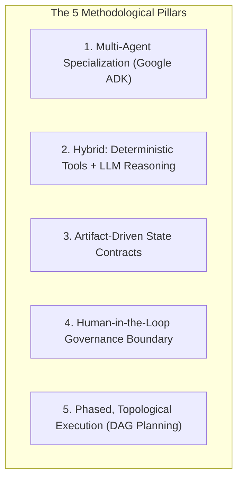

Viewed implementation-decisions.md:1-53

# Business Value & Methodology of the Mira Modernize Platform

The **Mira Modernize** platform addresses one of the most expensive and high-risk challenges in enterprise IT: **legacy software modernization and technical debt remediation**. 

Below is a detailed analysis of the **tangible business values** delivered by the platform, followed by the **architectural, methodological, and engineering approach** implemented in its design.

---

## Part 1: Business Value Delivered

```
┌────────────────────────────────────────────────────────────────────────────────────────┐
│                              Core Business Impact Matrix                               │
├───────────────────────┬───────────────────────────────────┬────────────────────────────┤
│ Business Metric       │ Traditional Manual Approach       │ With Mira Modernize        │
├───────────────────────┼───────────────────────────────────┼────────────────────────────┤
│ Assessment Time       │ 4 – 8 weeks per application       │ 5 – 10 minutes (Automated) │
│ Feasibility Accuracy  │ Subjective, prone to blind spots  │ 100% empirical evidence    │
│ Migration Risk        │ High (unforeseen breaking changes)│ Low (DAG plan + Rollback)  │
│ Scope Creep           │ Common (uncontrolled refactoring) │ Strict boundary guardrails │
│ Security & Governance │ Ad-hoc, manual documentation      │ Immutable audit artifacts  │
│ Senior Architect Time │ 60–80% spent on manual auditing   │ Focused only on governance │
└───────────────────────┴───────────────────────────────────┴────────────────────────────┘
```

### 1. Drastic Reduction in Time-to-Market & Modernization Costs
* **90%+ Reduction in Assessment Cycle Time**: Traditional application assessments require senior engineers to manually comb through build files, thousands of source files, transitive dependency trees, and framework documentation. Mira Modernize collapses this discovery phase from weeks to minutes using parallel autonomous agents.
* **Cost Efficiency in Engineering Hours**: By automating low-level discovery, dependency matrix evaluation, and impact mapping, enterprises save hundreds of billable engineering hours per application portfolio.

### 2. De-Risking Enterprise Modernization & Preventing Failed Migrations
* **Elimination of "Surprise" Breaking Changes**: Most modernization initiatives stall mid-flight because a transitive library has no compatible upgrade or a sunset framework (e.g., old Spring or J2EE versions) requires a ground-up rewrite. Mira Modernize identifies compatibility blockers up-front before any code is touched.
* **Deterministic Rollback & Verification**: Stage C automatically generates isolated git branches, baseline snapshot commits, automated validation checkpoints, and step-by-step rollback strategies.

### 3. Strict Scope & Budget Control (Preventing Scope Creep)
* **Selective, Modular Modernization**: Large enterprise codebases are rarely modernized all at once. Mira Modernize enables **Scope-Aware Modernization**—teams can scope migrations to specific modules or services.
* **Out-of-Scope Task Sentinel**: If an agent generates a refactoring task that affects code outside the approved business scope, the platform automatically flags it as `OUT_OF_SCOPE` with visual warnings, preventing runaway scope and unexpected regression testing costs.

### 4. Preservation of Architectural Governance (Human-in-the-Loop)
* **Retaining Executive Control**: Autonomous AI that modifies enterprise code unchecked is a liability. Mira Modernize enforces a strict architectural sign-off boundary (`AWAITING_APPROVAL`).
* **Informed Decision-Making**: Lead architects are presented with viable migration alternatives, risk trade-offs, and estimated impact, allowing them to approve, reject, or request a re-assessment with updated constraints.

### 5. Enterprise IP Protection & Regulatory Auditability
* **Immutable Compliance Trail**: Every stage outputs immutable JSON contracts (`modernization-request.json`, `feasibility-report.json`, `migration-decision.json`, `migration-blueprint.json`). This provides full lineage and traceability for compliance (SOX, ISO 27001, internal audit).
* **Zero-Trust Credential Security**: Git Personal Access Tokens (PAT) are encrypted in the user's browser using client-side **RSA-OAEP with SHA-256** before transit, guaranteeing that enterprise source control credentials are never exposed across network boundaries.

---

## Part 2: The Approach Followed in the Application

The platform combines **Agentic AI orchestration**, **deterministic software engineering tools**, and **artifact-driven state machines**.



---

### Pillar 1: Multi-Agent Specialization via Google ADK
* **Anti-Monolith Strategy**: Monolithic LLM prompts fail on enterprise codebases due to token limits, context dilution, and hallucination.
* **Single Responsibility Principle (SRP)**: The application decomposes the problem into specialized agents:
  * `RepositoryDiscoveryAgent`: Map file structures, modules, build descriptors.
  * `TechnologyDiscoveryAgent`: Identify languages, runtimes, build tools.
  * `DependencyAnalysisAgent`: Cross-reference dependencies against target compatibility.
  * `SourceAnalysisAgent`: Detect deprecated syntax, breaking APIs, package shifts.
  * `FrameworkAnalysisAgent`: Assess framework upgrade compatibility.
  * `ConfigurationAnalysisAgent`: Inspect properties, XML, YAML descriptors.
  * `QualitySecurityAgent`: Surface vulnerabilities, hardcoded secrets, test coverage.
  * `AssessmentAggregator`: Merge findings and prioritize risks.
  * `FeasibilityAgent`: Reason over blockers, viable alternatives, and prerequisites.
  * `MigrationPlannerAgent`: Generate actionable multi-phase blueprints.
* **Hierarchical ADK Trees**: Uses `SequentialAgent` for ordered pipeline flow and `ParallelAgent` for concurrent execution across independent analysis domains.

---

### Pillar 2: Hybrid Determinism — "Tools for Facts, LLM for Reasoning"
To guarantee zero-hallucination assessment:
1. **Deterministic Tools Harvest Facts (Read-Only)**:
   * Parsers read actual Maven `pom.xml`, Gradle files, and Pip manifests.
   * File searchers and AST utilities locate exact file paths and line numbers.
   * Workspace security tools strictly enforce path sandboxing (`os.path.commonpath`) to prevent path traversal attacks.
2. **LLMs Interpret and Reason**:
   * The LLM does not guess the codebase structure. It receives verified empirical evidence and reasons over compatibility matrices, breaking changes, architectural risks, and phased scheduling.

---

### Pillar 3: Artifact-Driven State Machine Architecture
* **State Decoupling**: Agents do not maintain fragile in-memory conversation state. Instead, every transition produces a validated Pydantic schema written as an immutable JSON file in the [artifacts/](file:///d:/Mira_modernize_stageC/artifacts) directory.
* **Resilience & Restartability**: If a network failure occurs, the workflow can resume from the last completed artifact without re-running expensive discovery stages.
* **Explicit State Engine**: Transitions are guarded by `WorkflowStateEngine`, enforcing strict lifecycles:
  $$\text{REQUEST\_CREATED} \rightarrow \text{DISCOVERY} \rightarrow \text{ASSESSMENT} \rightarrow \text{FEASIBILITY} \rightarrow \text{AWAITING\_HUMAN\_DECISION} \rightarrow \text{DECISION\_APPROVED} \rightarrow \text{MIGRATION\_PLAN\_READY}$$

---

### Pillar 4: Human-in-the-Loop (HITL) Architectural Gate
* **No Autonomous Code Disruption**: The assessment terminates at the feasibility evaluation. Stage C (Planning) is hard-locked (`HTTP 403 Forbidden`) until an explicit approval artifact (`migration-decision.json`) exists.
* **Bidirectional Re-assessment Loop**: If an architect determines an approach violates enterprise standards (e.g., *"We cannot use Spring Boot 3.3 yet due to company policy"*), they trigger **Re-assess** with additional constraints. The platform incorporates these rules without restarting repository ingestion.

---

### Pillar 5: Phased, Topological Execution Planning (Stage C)
Rather than a flat list of changes, the application designs modernization as an ordered engineering project:
1. **5 Standardized Modernization Phases**:
   * **Phase 1: Workspace & Baseline Isolation** (branches, baseline commit pinning).
   * **Phase 2: Build & Target Runtime Configuration** (compiler versions, build plugins).
   * **Phase 3: Dependency Upgrades** (library remediation).
   * **Phase 4: Source-Level & Framework Transformations** (code refactoring, import updates).
   * **Phase 5: Automated Verification** (unit, integration, and regression tests).
2. **Directed Acyclic Graph (DAG) Task Scheduling**: Tasks declare explicit prerequisites (`taskGraph` / `dependsOnTaskId`), ensuring build updates occur before code refactoring, which in turn precedes regression testing.
3. **Automated Verification Checkpoints**: Gates are placed between phases requiring criteria like *"Clean compilation without build errors"* or *"100% pass rate on test suites"*.

---

## Summary

| Dimension | How Mira Modernize Achieves It |
| :--- | :--- |
| **Why it creates value** | Eliminates months of manual technical debt auditing, eliminates failed migration risks, prevents scope creep, and protects developer velocity. |
| **How it was built** | Google ADK multi-agent architecture, deterministic read-only tools, immutable artifact contracts, client-side zero-trust cryptography, and strict human architectural governance. |