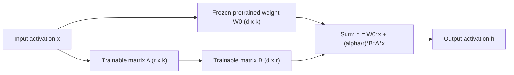
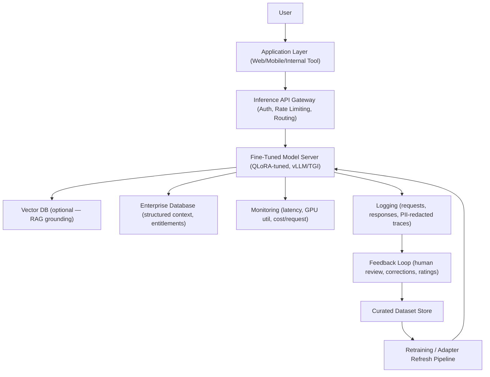
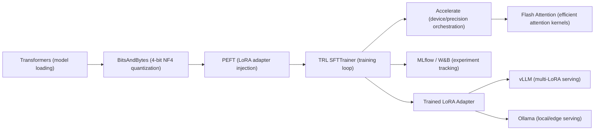
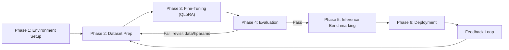
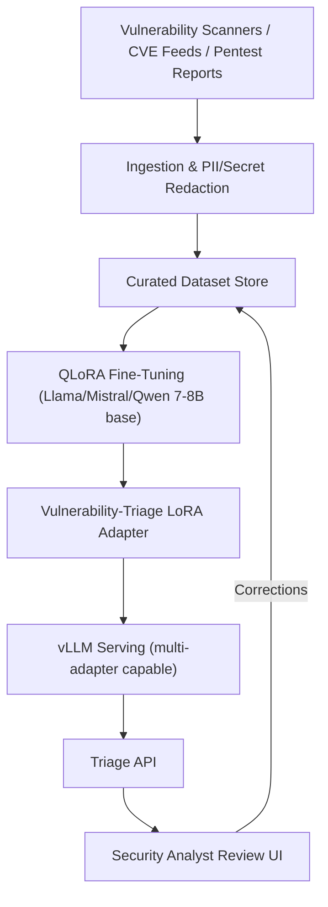

# Beyond General LLMs: High-Performance, Low-Cost Domain Fine-Tuning with QLoRA

**Internal Engineering Research & Design Document**
**Classification:** Internal / Engineering Reference
**Audience:** AI Engineers · ML Engineers · Data Scientists · Technical Architects · Engineering Managers
**Prerequisite Knowledge:** Working understanding of LLMs (transformer architecture, tokenization, inference); no prior PEFT experience assumed.
**Document Type:** Engineering Design & Research Document (source material for blog series, internal wiki, training curriculum, and conference talk)

---

## How to Use This Document

This is a research and design document, not a marketing article. Every technical section follows a consistent pattern: **the problem first, the mechanism second**. Sections include comparison tables, Mermaid-described diagrams, mathematical intuition, interview questions, key takeaways, and practical exercises so the material can be lifted directly into a blog series, a wiki page, or a training deck without re-research.

---

## Table of Contents

1. Executive Summary
2. Background
3. Problem Statement
4. Domain-Specific Language Models (DSLMs)
5. Understanding Fine-Tuning
6. Parameter-Efficient Fine-Tuning (PEFT)
7. Deep Dive into LoRA
8. Deep Dive into QLoRA
9. Enterprise Architecture
10. Technology Stack
11. Dataset Strategy
12. Hands-on Implementation Roadmap
13. Sample Project — Cybersecurity Vulnerability Assistant
14. Evaluation
15. Business Value
16. Challenges
17. Best Practices
18. Common Mistakes
19. Future Trends
20. Learning Roadmap
21. References
22. Glossary

---

## 1. Executive Summary

### 1.1 Motivation

Over the past three years, enterprises defaulted to routing nearly every AI workload — chat, extraction, summarization, classification, code generation — through a small number of frontier proprietary APIs (GPT-4-class, Claude-class, Gemini-class models). This "one model for everything" pattern was the fastest path to a working prototype, but it is increasingly the wrong default for production systems with narrow, repeatable domains.

**Why enterprises are moving away from always calling large proprietary models:**

- **Cost does not scale linearly with value.** A 400B+ parameter model charges the same per-token rate whether the task is "summarize this internal ticket" or "draft a multi-step legal opinion." Most enterprise workloads are narrow — the marginal capability of a frontier generalist model is wasted on them.
- **Latency is dominated by model size**, not task complexity. A vulnerability triage classifier does not need 100+ billion parameters of world knowledge to decide severity — it needs precise recall of a narrow schema.
- **Data governance friction.** Sending proprietary source code, patient records, or financial statements to a third-party API introduces contractual, regulatory, and audit overhead that in-house or VPC-hosted models avoid.
- **Vendor concentration risk.** A pricing change, rate limit, deprecation, or policy shift at a single vendor becomes a business continuity risk when every workload depends on one external API.

### 1.2 Business Problem

Engineering leadership is being asked, simultaneously, to (a) reduce AI infrastructure spend, (b) improve domain accuracy and reduce hallucinations, (c) satisfy data residency and privacy requirements, and (d) avoid single-vendor lock-in — while shipping features on the same or faster timeline. These goals appear to conflict with the "call a frontier API" default.

### 1.3 Technical Solution

**Parameter-efficient fine-tuning (PEFT)** — specifically **LoRA** (Low-Rank Adaptation) and its quantized variant **QLoRA** — resolves this tension. Instead of retraining a full foundation model (financially and computationally prohibitive for most teams) or relying entirely on prompting a general model (capped accuracy, high per-call cost), QLoRA lets teams:

- Fine-tune 7B–14B open-weight base models on a **single consumer or mid-tier datacenter GPU** (e.g., one NVIDIA A100 40GB, or even a 24GB card for smaller models).
- Reduce trainable parameters by **99%+** relative to full fine-tuning, while retaining task performance close to full fine-tuning on narrow domains.
- Produce a small adapter (tens to hundreds of MB) that can be merged into the base model or hot-swapped at inference time.
- Deploy the resulting model on-premise, at the edge, or in a private VPC, cutting inference cost by **70–90%** relative to continuous frontier-API usage for high-volume, narrow-domain workloads.

This document is the engineering research base for a blog series and internal training material describing how, when, and why to apply this approach.

### Key Takeaways
- Frontier general-purpose LLMs are a poor default for narrow, high-volume, repeatable enterprise tasks.
- QLoRA makes domain fine-tuning economically and computationally accessible to teams without hyperscale infrastructure.
- The decision is not "prompting vs. fine-tuning" — it's choosing the right tool per workload, and PEFT expands what's affordable to fine-tune.

### Interview Questions
1. Why doesn't inference cost scale with task complexity in most enterprise LLM deployments?
2. What are the four business pressures driving domain specialization, and how do they interact?
3. What is the core trade-off QLoRA is designed to resolve?

---

## 2. Background

### 2.1 Evolution of LLMs

| Era | Representative Models | Characteristic |
|---|---|---|
| Statistical NLP (pre-2013) | n-gram models, CRFs | Task-specific, no transfer learning |
| Word Embeddings (2013–2017) | Word2Vec, GloVe | Distributed representations, still shallow |
| Seq2Seq / RNN-Attention (2014–2017) | Bahdanau attention, LSTM-based MT | Attention mechanism introduced |
| Transformer Era (2017–2019) | Transformer, BERT, GPT-1/2 | Self-attention replaces recurrence; pretrain-then-finetune paradigm |
| Scaling Era (2020–2022) | GPT-3, PaLM, OPT | Few-shot / in-context learning emerges at scale |
| Instruction & Alignment Era (2022–2023) | InstructGPT, ChatGPT, GPT-4, Claude, Llama 2 | RLHF/RLAIF, chat-tuned models, open-weight ecosystems |
| Efficiency & Specialization Era (2023–present) | Llama 3/4, Mistral, Qwen, Gemma, SLMs, QLoRA-tuned domain models | Focus shifts from "bigger" to "efficient, specialized, deployable" |

### 2.2 Why GPT-Style (Decoder-Only Transformer) Models Became Popular

- **Architectural simplicity at scale**: a single stack of decoder blocks (self-attention + feed-forward) trained with a next-token-prediction objective scales predictably with data and compute (empirically described by the "scaling laws" literature).
- **Emergent generality**: at sufficient scale, a single pretraining objective produces a model that performs translation, summarization, reasoning, and code generation without task-specific architectures.
- **Zero/few-shot capability**: prompting alone, without any gradient update, can elicit competent task performance — this collapsed the cost of experimentation from "train a model" to "write a prompt."

### 2.3 Challenges of General-Purpose Models

- **Breadth vs. depth trade-off**: a model trained on a broad internet-scale corpus allocates capacity across every domain; a narrow enterprise domain (e.g., a specific regulatory framework, an internal codebase's conventions, a proprietary product's terminology) is a rounding error in that training distribution.
- **Static knowledge cutoff**: general models do not natively know an enterprise's internal systems, recent policy changes, or proprietary taxonomies.
- **Cost structure mismatch**: general models are priced (or provisioned) for worst-case complexity, not typical-case simplicity.
- **Opaque failure modes**: hallucinations in a general model are hard to systematically suppress via prompting alone, especially for structured, high-precision domain outputs.

### 2.4 Why Domain Specialization Matters

A domain-specialized model narrows the output distribution to the shapes, vocabulary, and reasoning patterns that matter for a specific task family. This narrowing is precisely what makes small, efficient models competitive with — and sometimes superior to — general frontier models *within that domain*, while being dramatically cheaper to run.

### Key Takeaways
- LLM evolution has been a progression from task-specific models to general-purpose scaled models, and is now bifurcating toward efficient specialization.
- Generality has a cost: capacity spent on breadth is capacity not spent on domain depth.
- Specialization is not a step backward — it's a targeted reallocation of model capacity toward what a specific workload actually needs.

### Interview Questions
1. What architectural property of decoder-only transformers enabled the scaling-law-driven growth of LLMs?
2. Why can a small, specialized model outperform a much larger general model on a narrow task?
3. What does "static knowledge cutoff" mean, and why is it a specific problem for enterprise use cases?

---

## 3. Problem Statement

Enterprises adopting LLMs at scale consistently encounter six categories of problems:

### 3.1 High Inference Costs
Per-token API pricing for frontier models, multiplied across millions of monthly requests, produces operating costs that scale linearly (or worse, with retries and long contexts) with usage — with no ceiling and no ownership of the resulting cost curve.

### 3.2 Hallucinations
General models generate fluent but factually or procedurally incorrect content when asked about narrow domains outside their training distribution's density — a critical failure mode in regulated or safety-relevant domains (clinical, legal, financial, security).

### 3.3 Domain Knowledge Limitations
Proprietary terminology, internal system names, non-public regulations, and organization-specific workflows are, by definition, absent or underrepresented in any public pretraining corpus.

### 3.4 Data Privacy
Sending regulated data (PII, PHI, financial records, source code, trade secrets) to a third-party inference API creates contractual, compliance (GDPR, HIPAA, SOC 2, PCI-DSS), and audit exposure that many enterprises cannot accept for certain workloads.

### 3.5 Vendor Lock-In
Building critical-path product features on a single external model provider's API creates dependency risk: pricing changes, deprecations, rate limits, and policy shifts are outside the enterprise's control.

### 3.6 Latency
Large proprietary models, especially under high load or with long contexts, introduce tail latencies unsuitable for real-time or interactive use cases; self-hosted smaller models on optimized inference stacks (vLLM, TensorRT-LLM) offer materially lower and more predictable latency.

| Problem | Root Cause | PEFT/QLoRA Mitigation |
|---|---|---|
| High inference cost | Pay-per-token pricing on large models | Smaller fine-tuned models match task accuracy at a fraction of parameter count |
| Hallucination | Domain underrepresented in pretraining | Fine-tuning anchors outputs in domain-specific patterns |
| Domain knowledge gaps | Proprietary/non-public data | Fine-tuning injects internal knowledge directly into weights |
| Data privacy | Third-party API data transfer | Self-hosted fine-tuned models keep data in-VPC/on-prem |
| Vendor lock-in | Single external dependency | Open-weight base models + owned adapters = full model ownership |
| Latency | Model size, provider queuing | Smaller model + optimized serving stack = lower, more predictable latency |

### Key Takeaways
- These six problems compound — a single frontier-API-only architecture is simultaneously the most expensive, least private, and least controllable option.
- Fine-tuning does not address every problem independently; it is a structural fix that improves cost, privacy, and control together.

### Interview Questions
1. Why is "hallucination" often a symptom of distributional mismatch rather than a model capability failure?
2. Name three regulatory frameworks that make third-party API calls with regulated data a compliance risk.
3. Why does self-hosting a smaller model improve latency predictability, not just average latency?

---

## 4. Domain-Specific Language Models (DSLMs)

### 4.1 Definition

A **Domain-Specific Language Model (DSLM)** is a language model — typically derived from an open-weight foundation model via fine-tuning — whose training data, evaluation criteria, and deployment context are narrowed to a specific industry, task family, or organizational knowledge base. The goal is not maximal general capability but maximal reliability and efficiency within a bounded scope.

### 4.2 Examples by Domain

| Domain | Example Focus Areas | Typical Base Model Size |
|---|---|---|
| Legal | Contract review, clause extraction, case summarization | 7B–14B |
| Financial | Earnings call analysis, risk memo drafting, regulatory filings QA | 7B–14B |
| Clinical / Medical | Clinical note summarization, differential diagnosis support (with human oversight), coding assistance | 7B–13B |
| Cybersecurity | Vulnerability triage, CVE summarization, log analysis, threat intel extraction | 7B–8B |
| Customer Support | Product-specific troubleshooting, ticket classification, response drafting | 3B–8B |
| Code / DevOps | Internal API usage patterns, IaC generation, code review against internal standards | 7B–14B |

### 4.3 Use Cases

- Structured extraction from unstructured domain documents (e.g., extracting CVE, CVSS score, affected component from a vulnerability report).
- Domain-constrained conversational assistants (e.g., a support bot that only reasons about one product line).
- Internal copilot tools trained on an organization's own codebase conventions and documentation.
- Regulatory-compliant summarization where outputs must follow a fixed schema and terminology.

### 4.4 Enterprise Adoption Patterns

Enterprises typically adopt DSLMs incrementally:

1. **Prompt-only baseline** on a general API (fastest, cheapest to start, weakest guarantees).
2. **Retrieval-augmented generation (RAG)** on top of a general model (adds grounding, does not change model behavior/style/precision).
3. **PEFT-tuned open-weight model** (this document's focus) — combines the grounding benefits achievable via RAG with behavior and precision changes baked into weights, at a fraction of full fine-tuning cost.
4. **Full fine-tuning or continued pretraining** (rare — reserved for the largest, most resourced organizations with very high-volume, very narrow, long-lived use cases).

Most mature enterprise deployments today combine **stage 2 and stage 3**: a QLoRA-tuned domain model with a RAG layer for facts that change more frequently than a retraining cadence allows.

### Key Takeaways
- A DSLM trades general capability for domain reliability and efficiency.
- DSLMs and RAG are complementary, not competing — fine-tuning changes *how* a model reasons and communicates; RAG supplies *current facts*.
- Enterprise adoption is staged, not a single leap from "prompt a frontier API" to "fine-tune everything."

### Interview Questions
1. What is the difference between what fine-tuning changes in a model versus what RAG changes?
2. Why might an organization choose a 7B fine-tuned model over a 70B+ general model for a narrow task?
3. Describe a use case where combining QLoRA fine-tuning with RAG is preferable to either alone.

---

## 5. Understanding Fine-Tuning

Before covering PEFT, it's necessary to understand the full spectrum of adaptation techniques it sits within.

### 5.1 Full Fine-Tuning

**Problem it solves:** Maximizes task-specific performance by allowing every model parameter to update in response to new training data.

**How it works:** Standard supervised training — forward pass, loss computation, backpropagation through *all* parameters, optimizer step on *all* parameters. For a 7B-parameter model, this means 7 billion parameters have gradients and optimizer states (for Adam, typically 2 additional FP32 buffers per parameter — momentum and variance), pushing memory requirements to 4–6x the model's own footprint.

**Cost implication:** A 7B model in FP16 (~14GB of weights) requires on the order of 70–120GB of GPU memory to full fine-tune with Adam-family optimizers (weights + gradients + optimizer states + activations), typically necessitating multi-GPU setups. This is the core problem PEFT was invented to solve.

### 5.2 Transfer Learning

**Problem it solves:** Reduces the data and compute needed to reach good performance on a new task by reusing representations learned on a large, related source task.

**How it works:** A model pretrained on a broad objective (e.g., next-token prediction over internet text) is used as an initialization point, then adapted — via full fine-tuning, PEFT, or feature extraction — to a downstream task with far less task-specific data than training from scratch would require.

### 5.3 Instruction Tuning

**Problem it solves:** Raw pretrained ("base") models are next-token predictors, not compliant assistants — they complete text patterns, not follow instructions.

**How it works:** The model is fine-tuned on (instruction, response) pairs across a diverse task mixture, teaching it to interpret an instruction and produce an appropriately-formatted, on-task response rather than an arbitrary continuation.

### 5.4 Supervised Fine-Tuning (SFT)

**Problem it solves:** Adapts a model to a specific task or domain using labeled input-output examples, the umbrella technique under which instruction tuning and most domain fine-tuning (including the QLoRA workflows in this document) fall.

**How it works:** Standard cross-entropy loss between model-generated tokens and target tokens in curated (prompt, completion) pairs. This is the primary technique used in the sample project in Section 13.

### 5.5 RLHF (Overview Only)

**Problem it solves:** SFT teaches a model to imitate example responses, but doesn't directly optimize for *human preference* between multiple plausible responses — RLHF closes that gap.

**How it works (high level):**
1. Collect human preference data: given a prompt and multiple model completions, humans rank or choose the better one.
2. Train a **reward model** to predict human preference scores from (prompt, response) pairs.
3. Fine-tune the base (typically SFT-tuned) model using reinforcement learning (historically PPO; increasingly DPO/simplified preference-optimization methods that skip the explicit reward model) to maximize the learned reward, with a KL-divergence penalty against the original SFT model to prevent degenerate drift.

RLHF (and successors like DPO) is typically **out of scope** for narrow enterprise domain fine-tuning — SFT alone, on a well-curated dataset, is usually sufficient when the goal is precision and domain grounding rather than open-ended preference alignment. It's covered here for completeness of the fine-tuning landscape.

| Technique | Primary Goal | Data Required | Typical Enterprise Use |
|---|---|---|---|
| Full Fine-Tuning | Maximum adaptation | Large | Rare — reserved for high-resource, high-volume cases |
| Transfer Learning | Reduce data/compute needs | Small–medium | Foundational concept, not a standalone technique |
| Instruction Tuning | Teach instruction-following | Medium–large, diverse | Usually inherited from base model choice |
| Supervised Fine-Tuning | Task/domain adaptation | Small–medium, curated | **Primary technique for enterprise DSLMs** |
| RLHF / DPO | Preference alignment | Preference-labeled pairs | Rare in narrow domains; common in general assistants |

### Key Takeaways
- Full fine-tuning's memory cost — not its effectiveness — is the reason PEFT exists.
- SFT is the workhorse technique for enterprise domain fine-tuning; RLHF solves a different problem (preference alignment) that most narrow domains don't need.
- Instruction tuning is what turns a base model into something promptable; most enterprise fine-tuning starts from an already-instruction-tuned checkpoint.

### Interview Questions
1. Why does Adam-family optimization roughly triple the memory footprint of full fine-tuning relative to just storing the model weights?
2. What's the practical difference between starting fine-tuning from a "base" model versus an "instruct" model?
3. Why might an enterprise deliberately skip RLHF/DPO for a domain fine-tuning project?

---

## 6. Parameter-Efficient Fine-Tuning (PEFT)

### 6.1 What Problem Does PEFT Solve?

Full fine-tuning requires updating and storing gradients/optimizer states for every parameter, which is memory-prohibitive for models beyond a few hundred million parameters on commodity hardware, and produces a full model-sized checkpoint (tens of GB) *per task* — untenable when an enterprise wants many task-specific variants.

### 6.2 How PEFT Works (General Principle)

PEFT techniques freeze the vast majority of the pretrained model's weights and introduce a small number of new, trainable parameters — inserted into the architecture in various ways — that are updated during fine-tuning. Because gradients and optimizer states are only needed for this small parameter subset, memory requirements drop dramatically, and the resulting artifact (the "adapter") is small enough to store many domain variants cheaply and swap between them at runtime.

### 6.3 PEFT Technique Comparison

| Technique | Mechanism | Trainable Params (typical) | Inference Overhead | Notes |
|---|---|---|---|---|
| **Adapter Tuning** | Small bottleneck feed-forward layers inserted between transformer sublayers | 0.5–5% | Adds layers → small latency cost | Earliest PEFT approach (Houlsby et al., 2019) |
| **Prefix Tuning** | Learnable continuous vectors prepended to keys/values at every layer | 0.1–1% | Consumes context budget | Effective for generation tasks; harder to optimize |
| **Prompt Tuning** | Learnable "soft prompt" embeddings prepended to input only (not every layer) | <0.1% | Minimal, but consumes input tokens | Scales well with model size; weaker on smaller models |
| **IA3** | Learned vectors that rescale (multiply) activations in attention and FFN | <0.01% | Negligible | Extremely lightweight; strong on classification-style tasks |
| **LoRA** | Learned low-rank update matrices added to existing weight matrices | 0.1–3% | **Zero at inference if merged** | Most widely adopted; strong accuracy/efficiency balance |
| **QLoRA** | LoRA applied on top of a 4-bit quantized frozen base model | Same as LoRA | Zero if merged (post-dequantization) | Enables fine-tuning on dramatically less GPU memory than LoRA alone |

### 6.4 Why LoRA/QLoRA Dominate Enterprise Adoption

- **Zero inference-time latency overhead** once adapter weights are merged back into the base weight matrices (unlike adapters, prefix tuning, and prompt tuning, which retain a permanent forward-pass cost or context-budget cost).
- **Composable and swappable**: multiple LoRA adapters (one per domain/task) can be trained against the same frozen base model and hot-swapped at serve time.
- **Mature, well-supported tooling** (Hugging Face `peft`, `bitsandbytes`) with production-grade serving support (vLLM multi-LoRA serving).
- **QLoRA's specific innovation** — combining 4-bit quantization of the frozen base with LoRA — is what makes fine-tuning a 7B–13B model feasible on a single consumer/prosumer GPU, which is the central economic unlock this document is about.

### Key Takeaways
- All PEFT techniques share the same core idea: freeze almost everything, train a small injected parameter set.
- LoRA and QLoRA are preferred in production because merged adapters add zero inference-time overhead — a decisive advantage over adapter/prefix/prompt tuning.
- QLoRA's contribution is specifically about *training-time* memory efficiency, not a new adaptation mechanism — it layers quantization under LoRA.

### Interview Questions
1. Why do adapter tuning and prefix tuning retain inference-time overhead, while LoRA does not?
2. What's the fundamental trade-off IA3 makes compared to LoRA?
3. Why does the number of trainable parameters matter for both training cost *and* deployment flexibility (multi-tenant adapters)?

---

## 7. Deep Dive into LoRA

### 7.1 What Problem Does LoRA Solve?

Full fine-tuning updates a weight matrix `W` (dimensions `d × k`) directly, requiring gradients and optimizer state proportional to `d × k` for *every* such matrix in the model. LoRA's insight (Hu et al., 2021): the *change* required to adapt a pretrained weight matrix to a new task is empirically low-rank — it doesn't need the full `d × k` degrees of freedom to be expressed effectively.

### 7.2 Mathematical Intuition

For a pretrained weight matrix `W₀ ∈ ℝ^(d×k)`, full fine-tuning would learn an update `ΔW ∈ ℝ^(d×k)` such that the adapted weight is `W = W₀ + ΔW`.

LoRA constrains `ΔW` to be low-rank by factoring it as:

```
ΔW = B · A
```

where `B ∈ ℝ^(d×r)`, `A ∈ ℝ^(r×k)`, and the rank `r ≪ min(d, k)` (typically `r = 4` to `64`, versus `d, k` often in the thousands).

The forward pass becomes:

```
h = W₀x + ΔWx = W₀x + BAx
```

`W₀` is **frozen** (no gradient computed or stored for it); only `A` and `B` are trainable. `A` is typically initialized with small random values (e.g., Kaiming/Gaussian), and `B` is initialized to **zero**, so that `ΔW = BA = 0` at the start of training — the adapted model is mathematically identical to the base model before any training occurs, guaranteeing a stable starting point.

A scaling factor `α` (alpha) is applied: `ΔW = (α / r) · BA`, which controls the magnitude of the LoRA update relative to the base weights, decoupled from the choice of rank `r`.

### 7.3 Trainable Parameter Count

For a matrix `W₀` of size `d × k`:

- Full fine-tuning trainable parameters: `d × k`
- LoRA trainable parameters: `d × r + r × k = r × (d + k)`

**Worked example:** A typical attention projection matrix in a 7B model might be `d = k = 4096`.
- Full fine-tuning: `4096 × 4096 = 16,777,216` parameters for this one matrix.
- LoRA with `r = 8`: `8 × (4096 + 4096) = 65,536` parameters — a **256x reduction** for this matrix.

Applied across all attention projection matrices (`q_proj`, `k_proj`, `v_proj`, `o_proj`) in a 32-layer 7B model, LoRA typically yields **total trainable parameters in the tens of millions**, versus **7 billion** for full fine-tuning — commonly cited as **0.1–1% of total model parameters**.

### 7.4 Memory Savings

| Component | Full Fine-Tuning | LoRA |
|---|---|---|
| Frozen base weights | N/A (all trainable) | Stored, no gradient |
| Trainable weights | 100% of model | 0.1–3% of model |
| Gradients | Full model size | Only LoRA params |
| Optimizer states (Adam: 2x params) | 2x full model size | 2x LoRA params (negligible) |
| Checkpoint size per task | Full model (tens of GB) | Tens to low hundreds of MB |

### 7.5 Diagram — LoRA Forward Pass (described)



**Reading the diagram:** the input `x` flows through two parallel paths — the frozen original weight `W₀`, and the new low-rank path `A` then `B` — and the two outputs are summed. Only the `A`/`B` path accumulates gradients.

### 7.6 Which Layers to Target

LoRA can be applied to any linear layer, but empirically the attention projections (`q_proj`, `k_proj`, `v_proj`, `o_proj`) and, increasingly, the MLP/feed-forward projections (`gate_proj`, `up_proj`, `down_proj` in Llama-family architectures) are targeted. Applying LoRA to *more* layer types generally improves task performance at a modest additional parameter/memory cost.

| Target Modules | Relative Trainable Params | Typical Use |
|---|---|---|
| Attention only (`q_proj`, `v_proj`) | Lowest | Fast experimentation, minor tasks |
| All attention projections (`q,k,v,o`) | Low–moderate | Common default |
| Attention + MLP projections | Moderate | Best accuracy/cost balance for domain SFT |

### Key Takeaways
- LoRA exploits the empirical observation that task-adaptation updates are low-rank, not that the model itself is low-rank.
- Zero-initializing `B` guarantees the fine-tuned model starts identical to the base model.
- Rank `r` and alpha `α` are the two primary hyperparameters controlling capacity and update magnitude respectively.

### Interview Questions
1. Derive the parameter count formula for a LoRA adapter on a `d × k` matrix and explain each term.
2. Why is `B` initialized to zero while `A` is initialized randomly?
3. What happens to inference latency if you merge `BA` into `W₀` versus keeping them as separate computation paths?

### Practical Exercise
Using Hugging Face `peft`, instrument a small model (e.g., a 1B-parameter open model) and print the ratio of trainable to total parameters for `r = 4, 8, 16, 32` with `target_modules=["q_proj","v_proj"]`. Plot trainable-parameter-percentage against `r`.

---

## 8. Deep Dive into QLoRA

### 8.1 What Problem Does QLoRA Solve?

LoRA dramatically reduces *trainable* parameters, but the **frozen base model still must be loaded into GPU memory in full precision** (typically FP16/BF16) to compute forward and backward passes through it. For a 7B model this is ~14GB just for weights, before activations — still out of reach for many single-GPU setups, and prohibitive for 13B–70B models. QLoRA (Dettmers et al., 2023) solves this by quantizing the frozen base model to 4-bit precision, cutting its memory footprint roughly 4x, while preserving fine-tuning quality through several precision-recovery techniques.

### 8.2 4-bit NormalFloat (NF4) Quantization

**Problem it solves:** Naive uniform 4-bit quantization wastes representational precision because pretrained neural network weights are not uniformly distributed — they are approximately normally distributed around zero. Uniform bins allocate equal resolution to rare, far-from-zero values and common, near-zero values.

**How it works:** NF4 is an **information-theoretically optimal** data type for normally-distributed data: it defines 16 quantization bins (for 4 bits) whose boundaries are chosen so that each bin contains an equal expected proportion of a zero-mean, unit-variance normal distribution (a quantile-based scheme), rather than equal-width bins. Because pretrained weights closely approximate this distribution after per-block normalization, NF4 preserves substantially more information than standard 4-bit integer or float quantization at the same bit width.

### 8.3 Double Quantization

**Problem it solves:** Quantization requires storing per-block scaling constants (quantization "zero-points"/scales) alongside the quantized weights. With small block sizes (needed for accuracy), these constants themselves consume non-trivial memory — roughly an extra 0.5 bits per parameter for typical block sizes.

**How it works:** Double quantization **quantizes the quantization constants themselves** (typically from FP32 to 8-bit, in blocks), reducing this overhead further — QLoRA's paper reports this saves approximately 0.37 bits per parameter on average across a 65B model, without measurable performance degradation.

### 8.4 Paged Optimizers

**Problem it solves:** Training involves memory usage spikes — for example, when a long sequence produces unusually large activation/gradient buffers — that can trigger out-of-memory (OOM) crashes even when *average* memory usage is well within budget.

**How it works:** Paged optimizers use NVIDIA's **unified memory** feature to automatically page optimizer states between GPU and CPU memory on demand, similar to how operating systems page virtual memory to disk — absorbing transient memory spikes without crashing training, at the cost of some throughput during page transfers.

### 8.5 Putting It Together: The QLoRA Recipe

1. Load the pretrained base model with weights quantized to **NF4**, using **double quantization** for the quantization constants. The base model is frozen throughout.
2. During the forward/backward pass, quantized weights are **dequantized on-the-fly** to BF16 for the actual matrix multiplication (compute happens in higher precision; storage stays in 4-bit) — this is why QLoRA preserves accuracy close to full-precision LoRA despite 4-bit storage.
3. Attach **LoRA adapters** (Section 7) to the (dequantized-at-compute-time) linear layers; only these adapter parameters are trainable.
4. Use a **paged optimizer** (e.g., paged AdamW, via `bitsandbytes`) to absorb memory spikes.
5. Backpropagate gradients only through the LoRA parameters — gradients never need to be computed or stored for the frozen 4-bit base weights.

### 8.6 Memory Comparison

| Configuration | Approx. Memory for a 7B Model | Feasible Hardware |
|---|---|---|
| Full fine-tuning (FP16 + Adam) | ~70–110 GB | Multi-GPU datacenter node |
| LoRA on FP16 base | ~16–20 GB | Single 24GB+ GPU (e.g., RTX 4090, A10) |
| **QLoRA (NF4 base + LoRA)** | **~6–10 GB** | **Single consumer GPU (e.g., RTX 3090/4090, T4)** |

*(Figures are illustrative order-of-magnitude estimates; actual memory depends on sequence length, batch size, and target modules — always validate empirically for your specific configuration.)*

### 8.7 Why QLoRA Changed the Industry

Before QLoRA, fine-tuning any model above ~1–3B parameters realistically required datacenter-grade multi-GPU access — out of reach for most individual teams, startups, and even many enterprise groups without dedicated ML infrastructure budgets. QLoRA's central contribution was demonstrating that a **7B–65B parameter model could be fine-tuned on a single GPU** with **no statistically significant performance loss** relative to full 16-bit fine-tuning on benchmark tasks — collapsing the cost of domain fine-tuning from a multi-GPU-week datacenter reservation to a single-GPU, single-day (or hours) job. This is the direct enabler of the "70–90% inference cost reduction" and "vendor independence" business outcomes discussed in Section 15.

### Key Takeaways
- QLoRA's innovation is entirely about making the **frozen base model** cheap to hold in memory during training — it does not change how LoRA itself works.
- NF4 preserves precision by matching quantization bins to the actual (approximately normal) distribution of pretrained weights.
- Compute still happens in higher precision (BF16) via on-the-fly dequantization — QLoRA trades storage precision, not compute precision.

### Interview Questions
1. Why is uniform 4-bit quantization suboptimal for pretrained neural network weights, and what does NF4 do differently?
2. Explain what "double quantization" quantizes, and why it's needed at all.
3. What specific failure mode do paged optimizers prevent, and how do they borrow from OS-level virtual memory design?
4. Why doesn't storing weights in 4-bit degrade compute precision during the forward pass?

### Practical Exercise
Load a 7B open-weight model with `bitsandbytes` in 4-bit NF4 mode (`load_in_4bit=True, bnb_4bit_quant_type="nf4"`), attach a LoRA config via `peft`, and record actual `nvidia-smi` peak memory during a short training run. Compare against the same run with `bnb_4bit_quant_type="fp4"` and against LoRA-only (no quantization).

---

## 9. Enterprise Architecture

### 9.1 Reference Architecture Diagram



### 9.2 Component Responsibilities

| Component | Responsibility | Key Design Considerations |
|---|---|---|
| **Application Layer** | User-facing surface (chat UI, internal tool, API consumer) | Should be model-agnostic where possible, to allow swapping fine-tuned models without app rewrites |
| **Inference API Gateway** | AuthN/AuthZ, rate limiting, request routing, versioning | Route by task/domain to the correct model or LoRA adapter; supports canary rollout of new adapter versions |
| **Fine-Tuned Model Server** | Hosts the QLoRA-tuned model (often merged, or served via multi-LoRA serving) | Choice of serving engine (vLLM, TGI, Ollama) determines throughput, batching, and multi-adapter support |
| **Vector DB (optional)** | Supplies retrieval-augmented context for facts that change faster than the fine-tuning cadence | Complementary to fine-tuning, not a replacement — see Section 4.4 |
| **Enterprise Database** | Structured context: user entitlements, business objects, session state | Keeps the model stateless; business logic and access control live outside the model |
| **Monitoring** | Latency percentiles, GPU utilization, throughput, cost-per-request | Feeds capacity planning and SLA tracking |
| **Logging** | Full request/response traces (with PII redaction policies) | Required for both debugging and the feedback loop below |
| **Feedback Loop** | Captures human corrections, thumbs up/down, escalations | Primary source of new fine-tuning data — closes the loop back into the dataset |
| **Retraining / Adapter Refresh Pipeline** | Periodic or triggered re-fine-tuning as new curated data accumulates | Should version adapters independently of the base model for safe rollback |

### 9.3 Design Notes

- **Adapter-first deployment**: because a LoRA/QLoRA adapter is small (tens–hundreds of MB), enterprises should version and deploy *adapters*, not full merged models, keeping the frozen base model as a shared, cached artifact across many domain adapters — this is what enables **multi-LoRA serving** (Section 10) at scale.
- **Stateless model servers**: all session state, entitlements, and business context live in the enterprise database, not in the model server, to allow horizontal scaling and safe rolling deployments.
- **Feedback loop is the long-term differentiator**: the architectural value of owning the fine-tuning pipeline is that production feedback becomes a compounding asset (better training data → better adapter → better production outputs → better feedback), which is structurally unavailable when depending solely on a third-party API.

### Key Takeaways
- The reference architecture treats the fine-tuned model as one replaceable component in a larger system, not the entire system.
- Separating adapters from the base model is the key architectural decision enabling efficient multi-domain deployment.
- The feedback loop is what turns a one-time fine-tuning project into a continuously improving system.

### Interview Questions
1. Why should business logic and entitlements live outside the model server rather than being baked into prompts sent to the model?
2. What does "adapter-first deployment" enable that "merged-model-per-domain deployment" does not?
3. How does the feedback loop component create a compounding advantage over pure third-party API usage?

---

## 10. Technology Stack

| Tool | Category | Why It Exists / What Problem It Solves |
|---|---|---|
| **Hugging Face Transformers** | Model library | Unified API for loading, running, and fine-tuning thousands of open-weight architectures without reimplementing model code per architecture |
| **PEFT (Hugging Face)** | Fine-tuning library | Implements LoRA, QLoRA, prefix tuning, prompt tuning, IA3, etc. behind a consistent config-driven API; wraps a base model with adapters non-invasively |
| **TRL (Transformer Reinforcement Learning)** | Training library | Provides higher-level trainers (SFTTrainer, DPOTrainer, PPOTrainer) built on top of Transformers/PEFT, reducing SFT/RLHF boilerplate |
| **Accelerate** | Training infrastructure | Abstracts multi-GPU/multi-node/mixed-precision training setup so the same script runs on one GPU or a cluster with minimal code changes |
| **BitsAndBytes** | Quantization library | Implements 4-bit/8-bit quantized layers, NF4, double quantization, and paged optimizers — the core enabler of QLoRA's memory savings |
| **PyTorch** | Deep learning framework | Underlying tensor/autograd engine all of the above are built on |
| **CUDA** | GPU compute platform | Low-level GPU kernel execution that PyTorch, bitsandbytes, and Flash Attention depend on |
| **Flash Attention** | Attention kernel | Reduces attention's memory complexity from quadratic to near-linear in sequence length via IO-aware kernel fusion, cutting memory use and increasing training/inference throughput |
| **vLLM** | Inference serving engine | High-throughput serving via PagedAttention (memory-efficient KV-cache management) and continuous batching; supports serving many LoRA adapters against one base model simultaneously |
| **Ollama** | Local inference runner | Simplifies running quantized open-weight models locally/on-prem with a lightweight CLI/API — useful for prototyping and edge deployment |
| **MLflow** | Experiment tracking / model registry | Tracks fine-tuning runs, hyperparameters, metrics, and versions adapters/models for reproducibility and governance |
| **Weights & Biases (W&B)** | Experiment tracking | Real-time training visualization, hyperparameter sweep tooling, and team-shared dashboards for comparing fine-tuning runs |

### 10.1 How the Stack Fits Together



### Key Takeaways
- The stack separates concerns cleanly: model loading (Transformers) → memory efficiency (BitsAndBytes) → adaptation mechanism (PEFT) → training orchestration (TRL/Accelerate) → serving (vLLM/Ollama) → observability (MLflow/W&B).
- vLLM's multi-LoRA serving is what operationalizes the "adapter-first deployment" architecture decision from Section 9.
- Flash Attention benefits both training (larger effective batch/context within memory budget) and inference (throughput).

### Interview Questions
1. What specific problem does PagedAttention (vLLM) solve for serving, and how is it conceptually related to paged optimizers in QLoRA training?
2. Why is Accelerate valuable even for single-GPU training scripts?
3. What's the practical benefit of serving multiple LoRA adapters against a single loaded base model, versus loading a separate merged model per domain?

---

## 11. Dataset Strategy

### 11.1 What Problem Does Dataset Strategy Solve?

Fine-tuning quality is bounded above by data quality — a well-executed QLoRA training run on a poorly curated dataset will reliably underperform a mediocre training run on a well-curated one. Dataset strategy is the highest-leverage, most under-invested part of most fine-tuning projects.

### 11.2 Public Datasets

Useful for establishing baseline instruction-following capability or supplementing narrow domain data with broader task-format diversity. Should rarely be the *sole* source for a domain-specific fine-tune — public datasets by definition don't contain an organization's proprietary knowledge.

### 11.3 Internal Enterprise Datasets

The core value driver: historical tickets, internal documentation, resolved incidents, expert-authored reports, and past human-in-the-loop decisions. These encode exactly the domain patterns a DSLM needs. Requires careful **PII/PHI scrubbing** and **access-control-aware curation** before use in training data.

### 11.4 Synthetic Data Generation

**Problem it solves:** Enterprise domains often have too few high-quality labeled examples for robust fine-tuning (hundreds, not tens of thousands).

**How it works:** A strong general-purpose model (e.g., a frontier API) is used **offline**, one time, to generate additional (prompt, completion) pairs conditioned on real domain seed examples, schemas, or documents — expanding dataset size and diversity while keeping the *fine-tuned model itself* fully self-hosted going forward. Synthetic examples should always be validated by a domain expert or automated schema/consistency checks before inclusion, since generation errors compound if left uncorrected.

### 11.5 Data Cleaning

- De-duplication (exact and near-duplicate) to prevent overfitting to repeated examples.
- Removing malformed, truncated, or off-schema examples.
- Normalizing formatting (consistent prompt templates, consistent field ordering in structured outputs).
- Filtering for length outliers that could destabilize batch-level memory usage.

### 11.6 Annotation

- Domain experts label or correct examples — for structured extraction tasks, this often means verifying a schema-conformant JSON output against source text.
- Annotation guidelines should be written down and versioned, the same as code, since inconsistent labeling directly degrades fine-tuning quality.

### 11.7 Validation

- Hold out a validation split (and, ideally, a separate held-out **test** split never touched during hyperparameter tuning) stratified by task subtype to catch overfitting to the dominant pattern in the dataset.
- Validate schema conformance programmatically for structured-output tasks before training, not just after.

| Data Source | Strengths | Risks | Mitigation |
|---|---|---|---|
| Public datasets | Free, diverse, large | Not domain-specific, license considerations | Use for format/style baseline, not domain facts |
| Internal enterprise data | Highest domain fidelity | PII/PHI exposure, access control | Redaction pipeline, role-based curation review |
| Synthetic data | Scales small seed sets | Can encode generator's own errors/hallucinations | Expert review, schema validation, cap synthetic:real ratio |

### Key Takeaways
- Dataset quality is the primary lever on fine-tuning outcome quality — more so than most hyperparameter choices.
- Synthetic data generation is a bootstrapping tool, not a replacement for real domain data or expert validation.
- Data governance (PII/PHI handling, annotation guidelines, validation splits) should be treated as an engineering deliverable, not an afterthought.

### Interview Questions
1. Why is a well-curated small dataset often preferable to a large, noisy one for domain fine-tuning?
2. What specific risk does synthetic data generation introduce, and how is it mitigated?
3. Why should validation and test splits be stratified by task subtype rather than randomly sampled?

---

## 12. Hands-on Implementation Roadmap

### Phase 1 — Environment Setup
- Provision GPU (cloud or on-prem); confirm CUDA/driver compatibility.
- Install: `transformers`, `peft`, `trl`, `accelerate`, `bitsandbytes`, `torch` (CUDA build), `flash-attn` (optional but recommended).
- Verify 4-bit quantized model load succeeds and reports expected memory footprint via `nvidia-smi`.
- Set up experiment tracking (MLflow or W&B) before the first training run, not after.

### Phase 2 — Dataset Preparation
- Aggregate and de-identify source data (Section 11.3).
- Define the prompt/response template (must match the base model's chat template if starting from an instruct-tuned checkpoint).
- Generate synthetic augmentation if needed (Section 11.4), with expert validation.
- Split into train/validation/test; validate schema conformance programmatically.

### Phase 3 — Fine-Tuning
- Select base model (Section 13.2 walks through a concrete choice).
- Configure `BitsAndBytesConfig` (4-bit, NF4, double quantization, compute dtype BF16).
- Configure `LoraConfig` (rank, alpha, target modules, dropout).
- Configure `SFTTrainer` (TRL) with the prepared dataset, learning rate, batch size, gradient accumulation, and paged optimizer.
- Run training with checkpointing; monitor loss curves and validation metrics via the tracking tool from Phase 1.

### Phase 4 — Evaluation
- Run the held-out test set through both the base model and the fine-tuned model.
- Compute automated metrics (Section 14): task-appropriate combination of exact match, F1, ROUGE/BLEU (for generative summarization), BERTScore, and structured schema-conformance rate.
- Run a structured human evaluation pass on a sample, focused on hallucination rate and domain-correctness, not just fluency.

### Phase 5 — Inference
- Merge the LoRA adapter into the base model (for single-domain deployment) **or** keep it unmerged for multi-adapter serving via vLLM.
- Benchmark latency and throughput under realistic concurrency.
- Validate output schema conformance under production-like load (including edge cases and adversarial-ish inputs).

### Phase 6 — Deployment
- Deploy behind the Inference API Gateway (Section 9).
- Configure monitoring/logging/feedback loop from day one, not as a follow-up.
- Establish a re-training trigger policy (e.g., N new curated examples, or M weeks elapsed, or a monitored accuracy metric drop).



### Key Takeaways
- The roadmap is cyclical, not linear — evaluation failures route back to dataset work, and production feedback routes back into Phase 2 for the next iteration.
- Experiment tracking and monitoring should be set up *before* the first training/deployment run, not retrofitted.
- Evaluation (Phase 4) should always include a human review pass — automated metrics alone are insufficient for domain-correctness judgments.

### Interview Questions
1. Why does the roadmap route evaluation failures back to Phase 2 rather than directly to hyperparameter retuning?
2. What's the risk of skipping a human evaluation pass and relying solely on automated metrics?
3. What should trigger a re-training cycle in production, beyond a fixed calendar schedule?

---

## 13. Sample Project — Cybersecurity Vulnerability Assistant

### 13.1 Project Goal

Build a domain-specialized assistant that ingests vulnerability reports (e.g., CVE descriptions, internal pentest findings, dependency scan output) and produces structured, schema-conformant triage output: severity classification, affected component identification, exploitability summary, and a remediation recommendation draft — replacing a workflow that previously required a security analyst to manually read and triage each report, or an expensive per-call frontier API for a narrow, repeatable extraction task.

### 13.2 Base Model Choice

An open-weight 7B–8B instruct-tuned model is a reasonable default starting point for this class of task: large enough to reason over moderately complex security report text and follow structured-output instructions reliably, small enough to fine-tune via QLoRA on a single GPU and serve at low latency.

### 13.3 Folder Structure

```
vuln-assistant/
├── configs/
│   ├── bnb_config.yaml          # 4-bit quantization settings
│   ├── lora_config.yaml         # LoRA rank, alpha, target modules
│   └── training_config.yaml     # LR, batch size, epochs, eval strategy
├── data/
│   ├── raw/                     # Source vulnerability reports (access-controlled)
│   ├── processed/                # Cleaned, schema-validated (prompt, completion) pairs
│   ├── synthetic/                # Expert-reviewed synthetic augmentation
│   └── splits/                   # train.jsonl / val.jsonl / test.jsonl
├── src/
│   ├── data_prep.py              # Cleaning, dedup, schema validation
│   ├── synthetic_gen.py          # Synthetic data generation + validation harness
│   ├── train.py                  # QLoRA fine-tuning entrypoint (TRL SFTTrainer)
│   ├── merge_adapter.py          # Merges LoRA weights into base for single-domain deploy
│   ├── evaluate.py                # Automated metrics + schema-conformance checks
│   └── serve.py                   # vLLM/Ollama serving entrypoint
├── notebooks/
│   └── error_analysis.ipynb      # Manual review of failure cases
├── deployment/
│   ├── Dockerfile
│   └── k8s/                       # Serving manifests (or equivalent for target infra)
└── README.md
```

### 13.4 Architecture (Project-Level)



### 13.5 Training Pipeline (Conceptual)

1. **Input schema**: raw vulnerability report text (free text, possibly with embedded CVE IDs, CVSS vectors, affected package names).
2. **Target schema** (JSON): `{ "severity": "critical|high|medium|low", "affected_component": string, "cve_ids": [string], "exploitability_summary": string, "recommended_action": string }`.
3. Fine-tune with `SFTTrainer` using a fixed instruction template: system instruction defining the exact schema, followed by the raw report as user content, followed by the target JSON as the completion.
4. Train with QLoRA config: rank 16, alpha 32, target modules covering attention + MLP projections, NF4 quantization, paged AdamW optimizer, small learning rate (typically in the `1e-4` to `2e-4` range for LoRA, notably higher than typical full fine-tuning rates since only a small parameter subset is updating).

### 13.6 Inference Pipeline

- Request arrives at the Triage API with raw report text.
- API gateway authenticates and routes to the model server, selecting the `vuln-triage` LoRA adapter (if serving multiple domain adapters from one base).
- Model generates structured JSON; a schema validator checks conformance before returning to the caller.
- Non-conformant outputs are flagged for analyst review rather than silently returned (a critical guardrail for structured-extraction tasks).

### 13.7 Evaluation Pipeline

- **Schema conformance rate**: percentage of outputs that parse as valid JSON matching the target schema.
- **Field-level exact match / F1** for categorical fields (severity, component).
- **ROUGE/BERTScore** for the free-text `exploitability_summary` and `recommended_action` fields against expert-written references.
- **Hallucination rate**: percentage of outputs referencing a CVE ID or component not present in the source report — a domain-specific, task-critical metric.
- **Human spot-check**: security analysts review a stratified sample weekly, feeding disagreements back into the dataset.

### 13.8 Deployment Pipeline

- Containerize the merged model (or base + adapter) with the serving engine (vLLM) baked in.
- Deploy behind the Inference API Gateway with autoscaling tied to request queue depth.
- Wire monitoring (latency, schema-conformance rate, GPU utilization) and the analyst-correction feedback loop from day one.

### Key Takeaways
- A well-scoped sample project has a fixed, validatable output schema — this is what makes automated evaluation and hallucination detection tractable.
- The analyst review UI isn't an add-on; it's the primary feedback mechanism that funds continuous improvement of the adapter.
- Non-conformant model outputs should be routed to human review, never silently accepted, in a structured-extraction production system.

### Interview Questions
1. Why does fixing a strict output schema make hallucination *detection* easier, compared to open-ended generation tasks?
2. What's the purpose of validating schema conformance server-side before returning a response to the caller?
3. How would you extend the evaluation pipeline if the assistant also needed to recommend a *specific* patch version, not just a general remediation action?

---

## 14. Evaluation

### 14.1 Why Evaluation Strategy Matters

**Problem it solves:** A fine-tuned model that "looks fluent" in spot checks can still be systematically wrong in ways that only appear at scale or in edge cases. A rigorous, multi-metric evaluation suite is what separates a demo from a production system.

### 14.2 Metrics

| Metric | What It Measures | Best Suited For | Limitation |
|---|---|---|---|
| **BLEU** | N-gram precision overlap with reference | Machine translation-style tasks | Penalizes valid paraphrasing; weak for open-ended generation |
| **ROUGE** | N-gram/subsequence recall overlap with reference | Summarization | Same paraphrase-sensitivity issue as BLEU |
| **BERTScore** | Semantic similarity via contextual embeddings | Generation tasks where meaning matters more than exact wording | Computationally heavier; still an approximation of "correctness" |
| **Exact Match (EM)** | Binary: output exactly matches reference | Structured/categorical fields, short-form QA | Too strict for free-text fields |
| **F1** | Harmonic mean of precision/recall (token or field level) | Extraction tasks, classification | Needs clear field/token alignment definition |
| **Hallucination Rate** | Frequency of unsupported/fabricated claims relative to source | Any grounded generation task | Requires either human review or a strong reference-checking model |
| **Human Evaluation** | Expert judgment on correctness, usefulness, tone | All tasks, especially high-stakes domains | Expensive, slower, needs clear rubrics for consistency |
| **Latency** | Time to first token / total generation time | Production readiness | Must be measured under realistic concurrency, not single-request |
| **GPU Utilization** | Compute efficiency of serving | Cost/capacity planning | High utilization alone doesn't imply correctness |
| **Cost per Request** | Fully-loaded infra cost divided by request volume | Business case validation (Section 15) | Must include amortized training/retraining cost, not just serving |

### 14.3 Evaluation Design Principles

- Always evaluate against a **held-out** test set never used in hyperparameter tuning.
- Use **task-appropriate** metric combinations — no single metric is sufficient (e.g., a structured extraction task needs schema-conformance rate *and* field-level F1 *and* hallucination rate).
- Track metrics **longitudinally** across adapter versions to catch regressions introduced by retraining on new data (a form of evaluation-driven regression testing for models).
- For regulated domains, maintain a **fixed human-reviewed benchmark set** that is never used for training, to provide an auditable, stable accuracy baseline over time.

### Key Takeaways
- No single automated metric substitutes for a combination tailored to the task's actual failure modes.
- Cost-per-request must include amortized fine-tuning/retraining cost to be a fair comparison against API-based alternatives.
- A stable, human-reviewed benchmark set is both an evaluation tool and a governance/audit artifact in regulated domains.

### Interview Questions
1. Why are BLEU and ROUGE poor standalone metrics for open-ended generation tasks?
2. What does "hallucination rate" require as a prerequisite to be measurable at all?
3. Why should cost-per-request calculations include amortized retraining cost?

---

## 15. Business Value

Fine-tuned domain models produce measurable, trackable benefits across multiple business dimensions:

| Benefit Category | Typical Measured Impact | Mechanism |
|---|---|---|
| **Inference Cost Reduction** | 70–90% lower cost vs. continuous frontier-API calls for high-volume narrow tasks | Smaller self-hosted model + owned infrastructure vs. per-token external pricing |
| **Reduced Hallucinations** | Meaningful drop in domain-factual error rate on in-domain evaluation sets | Fine-tuning anchors output distribution in verified domain patterns |
| **Faster Responses** | Lower and more predictable p50/p99 latency | Smaller model + optimized serving stack (vLLM/Flash Attention) vs. large shared external API under variable load |
| **Data Privacy** | Regulated data never leaves the enterprise's environment | Self-hosted, in-VPC/on-prem deployment |
| **Regulatory Compliance** | Easier to satisfy data residency and auditability requirements | Full control over data flow, logging, and model versioning |
| **Vendor Independence** | No single point of external dependency for critical-path workloads | Open-weight base models + owned adapters = full model ownership |
| **Edge Deployment** | Enables offline/low-connectivity deployment scenarios | Quantized small models fit resource-constrained environments |

### 15.1 Building the Business Case

A rigorous business case compares **total cost of ownership (TCO)** — not just per-token inference price — across the two architectures:

- **Frontier-API-only TCO**: per-token cost × volume + integration engineering time. Scales linearly (or worse) with usage; no ceiling.
- **QLoRA-tuned self-hosted TCO**: one-time (or periodic) fine-tuning compute cost + serving infrastructure cost (amortized across volume) + ML engineering time for the pipeline in Section 9. Scales sub-linearly with usage past the infrastructure break-even point.

The break-even point depends heavily on request volume, latency requirements, and data sensitivity — for low-volume, highly varied, non-sensitive workloads, a general API may remain the right choice; for high-volume, narrow, sensitive workloads, self-hosted fine-tuned models typically win decisively.

### Key Takeaways
- Business value should be tracked per-dimension (cost, accuracy, latency, compliance, independence), not collapsed into a single "it's better" claim.
- The economic case depends on volume and sensitivity — this is a workload-selection decision, not a blanket replacement of API usage.
- TCO comparisons must include engineering and retraining costs on the fine-tuning side to be credible.

### Interview Questions
1. Under what workload characteristics does a frontier API remain more cost-effective than a self-hosted fine-tuned model?
2. What costs are commonly omitted from naive TCO comparisons in favor of fine-tuning, and why does that inflate the apparent savings?
3. How would you present a business case for fine-tuning to an engineering manager who is cost-conscious but skeptical of the accuracy claims?

---

## 16. Challenges

| Challenge | Description | Why It Happens |
|---|---|---|
| **Catastrophic Forgetting** | Fine-tuned model loses general capabilities it had before fine-tuning | Aggressive fine-tuning (high LR, too many epochs, high-rank/high-alpha LoRA) overwrites broadly-useful representations with narrow-task ones |
| **Data Quality** | Model inherits and amplifies dataset errors/inconsistencies | Fine-tuning is directly supervised by the dataset; there is no correction mechanism beyond the data itself |
| **Overfitting** | Model memorizes training examples rather than generalizing | Small datasets + too many epochs + insufficiently regularized LoRA (high rank, low dropout) |
| **GPU Requirements** | Even QLoRA-reduced requirements can be a blocker for teams without any GPU access | Cloud GPU availability/cost, procurement lead time for on-prem hardware |
| **Evaluation Complexity** | Hard to build evaluation sets that catch real production failure modes | Production input distribution often differs from curated training/eval data; adversarial/edge cases are hard to anticipate |
| **Maintenance** | Adapters need ongoing updates as domain knowledge changes | Static fine-tuned weights don't automatically reflect new regulations, products, or terminology |
| **Model Drift** | Production performance degrades over time relative to initial evaluation | Input distribution shift (new document formats, new terminology) without corresponding retraining |

### 16.1 Mitigations Summary

- **Catastrophic forgetting**: keep LoRA rank/alpha conservative for the task size, mix in a small proportion of general-instruction data alongside domain data, monitor general-capability benchmarks alongside domain metrics.
- **Data quality**: invest in the annotation/validation pipeline from Section 11 before scaling dataset size.
- **Overfitting**: use held-out validation loss for early stopping, not just training loss; apply LoRA dropout; avoid over-training on small datasets.
- **GPU requirements**: cloud spot/on-demand GPU instances lower the barrier further than QLoRA alone; batch fine-tuning jobs to amortize setup cost.
- **Evaluation complexity**: continuously mine production logs (via the feedback loop, Section 9) for real failure cases to add to the evaluation set.
- **Maintenance & drift**: establish a monitored metric (e.g., schema-conformance rate, or a sampled accuracy proxy) with an explicit retraining trigger threshold, not just a calendar-based cadence.

### Key Takeaways
- Most of these challenges are data and process problems, not fundamentally QLoRA/LoRA algorithmic limitations.
- Catastrophic forgetting and overfitting are both, at root, capacity/regularization mismanagement — rank, alpha, epochs, and data mixture are the levers.
- Maintenance and drift mean fine-tuning is a recurring engineering process, not a one-time project.

### Interview Questions
1. How would you detect catastrophic forgetting in a fine-tuned model, and what would you check first?
2. Why can a model with excellent training loss still perform poorly in production?
3. What's the difference between an overfitting problem and a model drift problem, and how would your mitigation differ?

---

## 17. Best Practices

1. **Start with the smallest base model that plausibly solves the task**, and only scale up if evaluation shows a genuine capability gap — smaller models are cheaper to fine-tune, serve, and iterate on.
2. **Invest in dataset curation before hyperparameter tuning.** A marginal hour spent on data quality typically outperforms a marginal hour spent on learning-rate search.
3. **Use a held-out validation set for early stopping**, and a separate, never-touched test set for final reporting.
4. **Initialize LoRA conservatively** (moderate rank, e.g., 8–16, before scaling up) and increase only if evaluation shows underfitting.
5. **Track experiments rigorously** (MLflow/W&B) from the first run — hyperparameter provenance is essential for reproducibility and debugging regressions.
6. **Version adapters independently of the base model**, and keep rollback capability to the previous adapter version at all times.
7. **Build the feedback loop and monitoring before, not after, initial deployment** — production data is the highest-value input to the next training iteration.
8. **Always include a schema/format validator** in the inference path for structured-output tasks; never trust raw model output directly downstream.
9. **Run a human evaluation pass on every meaningful training iteration**, not just automated metrics — especially for hallucination and domain-correctness judgments.
10. **Treat retraining as a recurring pipeline, not a one-time event** — define explicit triggers (data volume, time elapsed, monitored metric degradation).

### Key Takeaways
- Best practices consistently prioritize data and process rigor over hyperparameter tuning.
- Reproducibility (experiment tracking, adapter versioning) is a prerequisite for safe iteration, not a nice-to-have.
- Production monitoring and the feedback loop should exist from day one of deployment.

### Interview Questions
1. Why does dataset curation typically yield a higher return on engineering time than hyperparameter search?
2. What's the risk of deploying a fine-tuned model without independent adapter versioning?
3. Why is a schema validator a non-negotiable component for structured-output production systems?

---

## 18. Common Mistakes

- **Training too many epochs on a small dataset**, causing overfitting/memorization rather than generalization.
- **Setting LoRA rank/alpha far higher than the task needs**, increasing overfitting risk and training cost without accuracy benefit.
- **Skipping a held-out test set**, leading to overly optimistic reported performance that doesn't hold in production.
- **Mismatching the prompt template** between fine-tuning and inference (e.g., fine-tuning with one chat template, then serving with a different one) — this silently degrades output quality in ways that are hard to diagnose.
- **Fine-tuning on ungoverned data** containing PII/PHI or inconsistent labeling, propagating both compliance risk and quality issues into the model.
- **Relying solely on automated metrics**, missing hallucination or domain-correctness failures that only a human reviewer would catch.
- **Treating fine-tuning as a one-time project** rather than budgeting for ongoing retraining as the domain evolves.
- **Ignoring quantization-compute dtype mismatches** (e.g., misconfigured `bnb_4bit_compute_dtype`) that silently degrade numerical stability during training.
- **Not merging or properly loading the adapter at inference time**, resulting in the base model's (unfine-tuned) behavior being served accidentally.
- **Over-indexing on leaderboard benchmarks** instead of building an evaluation set that reflects the enterprise's actual production distribution.

### Key Takeaways
- Most common mistakes are process failures (missing validation, mismatched templates, ungoverned data), not algorithmic misunderstandings of LoRA/QLoRA.
- Prompt template mismatches are a particularly insidious failure mode because they degrade quality without throwing errors.
- Evaluation set fidelity to the real production distribution matters more than public benchmark performance.

### Interview Questions
1. Why does a prompt template mismatch between training and inference degrade quality silently rather than causing an obvious error?
2. What's the practical risk of judging a fine-tuned model purely by public leaderboard-style benchmarks?
3. How would you catch a misconfigured quantization compute dtype during development, before it affects a production training run?

---

## 19. Future Trends

- **Mixture of Experts (MoE)**: sparse architectures that activate only a subset of parameters per token, offering another axis (alongside PEFT) for decoupling parameter count from inference cost — increasingly relevant as base models for domain fine-tuning.
- **Small Language Models (SLMs)**: continued investment in highly capable sub-3B models purpose-built for efficient fine-tuning and edge deployment, narrowing the capability gap with larger models for well-scoped domains.
- **Agentic AI**: fine-tuned domain models increasingly serve as one component (a specialized "tool-using" or "reasoning" node) within larger multi-step agentic systems, rather than being the entire system.
- **Continual Learning**: techniques for updating a deployed model incrementally as new data arrives, without full retraining cycles or catastrophic forgetting — an active research area directly relevant to the "maintenance and drift" challenges in Section 16.
- **Federated Fine-Tuning**: training adapters across distributed, privacy-sensitive data sources (e.g., multiple hospital systems) without centralizing raw data, combining PEFT's efficiency with federated learning's privacy guarantees.

### Key Takeaways
- Future directions largely extend the same core theme of this document: decoupling model capability from parameter count and centralized compute.
- Agentic AI reframes domain fine-tuned models as components in larger systems rather than end-to-end solutions.
- Continual and federated learning both target current QLoRA workflow limitations — static snapshots and centralized data requirements, respectively.

### Interview Questions
1. How does MoE relate conceptually to PEFT's goal of decoupling capability from active parameter count?
2. Why is continual learning particularly relevant to the model drift challenge discussed in Section 16?
3. What privacy problem does federated fine-tuning solve that centralized QLoRA fine-tuning does not?

---

## 20. Learning Roadmap

### Beginner
- Transformer architecture fundamentals (attention, tokenization, embeddings).
- The difference between pretraining, instruction tuning, and task-specific fine-tuning (Section 5).
- Hands-on: run inference on an open-weight model locally via Ollama.

### Intermediate
- LoRA mathematical foundations (Section 7); implement a from-scratch low-rank adapter on a small linear layer to build intuition before using `peft`.
- Hugging Face `transformers` + `peft` + `trl` workflow: fine-tune a small model on a public instruction dataset.
- Experiment tracking fundamentals (MLflow or W&B).

### Advanced
- QLoRA internals (Section 8): quantization theory, NF4 derivation, paged optimizer mechanics.
- Multi-adapter serving with vLLM; adapter versioning and rollback strategy.
- Building a full evaluation suite (Section 14) for a real domain task, including hallucination measurement.

### Expert / Production
- Designing the full enterprise architecture (Section 9): feedback loops, retraining triggers, monitoring.
- Cost modeling and TCO analysis (Section 15) for build-vs-buy decisions.
- Exploring MoE, continual learning, and federated fine-tuning as next-generation extensions (Section 19).

### Key Takeaways
- The roadmap deliberately sequences *mathematical intuition before tooling* — understanding why LoRA works makes debugging fine-tuning runs far more tractable than treating `peft` as a black box.
- Production-readiness (monitoring, feedback loops, TCO) is its own advanced skill area, distinct from training mechanics.

---

## 21. References

**Foundational Papers**
- Hu, E. J., et al. "LoRA: Low-Rank Adaptation of Large Language Models." arXiv:2106.09685.
- Dettmers, T., et al. "QLoRA: Efficient Finetuning of Quantized LLMs." arXiv:2305.14314.
- Houlsby, N., et al. "Parameter-Efficient Transfer Learning for NLP." (Adapter tuning) arXiv:1902.00751.
- Li, X. L., & Liang, P. "Prefix-Tuning: Optimizing Continuous Prompts for Generation." arXiv:2101.00190.
- Lester, B., et al. "The Power of Scale for Parameter-Efficient Prompt Tuning." arXiv:2104.08691.
- Liu, H., et al. "Few-Shot Parameter-Efficient Fine-Tuning is Better and Cheaper than In-Context Learning." (IA3) arXiv:2205.05638.
- Ouyang, L., et al. "Training language models to follow instructions with human feedback." (InstructGPT/RLHF) arXiv:2203.02155.
- Rafailov, R., et al. "Direct Preference Optimization." arXiv:2305.18290.
- Dao, T., et al. "FlashAttention: Fast and Memory-Efficient Exact Attention with IO-Awareness." arXiv:2205.14135.
- Kwon, W., et al. "Efficient Memory Management for Large Language Model Serving with PagedAttention." (vLLM) arXiv:2309.06180.

**Official Documentation**
- Hugging Face `transformers` documentation.
- Hugging Face `peft` documentation.
- Hugging Face `trl` documentation.
- `bitsandbytes` GitHub repository and documentation.
- `vLLM` documentation (multi-LoRA serving guide).
- NVIDIA CUDA and Flash Attention documentation.

**GitHub Repositories**
- `huggingface/peft`
- `huggingface/trl`
- `bitsandbytes-foundation/bitsandbytes`
- `vllm-project/vllm`
- `artidoro/qlora` (original QLoRA release repository)

**Conference Talks / Further Viewing**
- NeurIPS 2023 QLoRA presentation (Dettmers et al.).
- Hugging Face community talks on PEFT and efficient fine-tuning (Hugging Face YouTube channel).

*Note: verify current arXiv identifiers, paper versions, and repository URLs before publishing externally — this list is a research starting point, not a final citation set.*

---

## 22. Glossary

| Term | Definition |
|---|---|
| **Adapter** | A small set of newly introduced, trainable parameters inserted into a frozen pretrained model to enable efficient task adaptation. |
| **Alpha (α)** | LoRA hyperparameter scaling the magnitude of the low-rank update, decoupled from rank. |
| **BERTScore** | An evaluation metric using contextual embeddings to measure semantic similarity between generated and reference text. |
| **BitsAndBytes** | A library implementing quantized (4-bit/8-bit) neural network layers and paged optimizers. |
| **BLEU** | An n-gram precision-based metric traditionally used for machine translation evaluation. |
| **Catastrophic Forgetting** | Loss of previously learned general capabilities as a result of aggressive task-specific fine-tuning. |
| **DPO (Direct Preference Optimization)** | A simplified alternative to RLHF that optimizes directly on preference pairs without a separate reward model. |
| **Double Quantization** | Quantizing the quantization scaling constants themselves, to further reduce memory overhead. |
| **DSLM (Domain-Specific Language Model)** | A language model fine-tuned and evaluated for a narrow domain or task family rather than general-purpose use. |
| **Flash Attention** | An IO-aware attention kernel implementation that reduces memory usage and increases throughput. |
| **Full Fine-Tuning** | Updating all parameters of a pretrained model during training. |
| **Hallucination** | Model-generated content that is fluent but factually or procedurally incorrect / unsupported by source material. |
| **IA3** | A PEFT technique that learns per-activation rescaling vectors rather than additive low-rank updates. |
| **Instruction Tuning** | Fine-tuning a base model on (instruction, response) pairs to teach instruction-following behavior. |
| **LoRA (Low-Rank Adaptation)** | A PEFT technique representing weight updates as the product of two small low-rank matrices, added to frozen pretrained weights. |
| **MoE (Mixture of Experts)** | A sparse architecture activating only a subset of model parameters ("experts") per input token. |
| **NF4 (4-bit NormalFloat)** | A quantization data type with quantile-based bins optimized for normally-distributed neural network weights. |
| **Paged Optimizer** | An optimizer implementation that pages optimizer state between GPU and CPU memory to absorb memory usage spikes. |
| **PEFT (Parameter-Efficient Fine-Tuning)** | An umbrella term for techniques that fine-tune a small subset of parameters while freezing the majority of a pretrained model. |
| **Prefix Tuning** | A PEFT technique prepending learnable continuous vectors to the keys/values at every transformer layer. |
| **Prompt Tuning** | A PEFT technique prepending learnable "soft prompt" embeddings only to the model's input. |
| **QLoRA** | LoRA fine-tuning applied on top of a 4-bit quantized frozen base model, using NF4, double quantization, and paged optimizers. |
| **Rank (r)** | The dimensionality of the low-rank matrices in LoRA, controlling adapter capacity. |
| **RLHF (Reinforcement Learning from Human Feedback)** | A technique aligning model outputs to human preferences via a learned reward model and reinforcement learning. |
| **ROUGE** | A recall-oriented n-gram/subsequence overlap metric commonly used for summarization evaluation. |
| **SFT (Supervised Fine-Tuning)** | Fine-tuning a model on labeled (input, output) example pairs using standard supervised loss. |
| **Transfer Learning** | Reusing representations learned on a source task/domain to improve learning efficiency on a related target task. |
| **vLLM** | A high-throughput LLM inference serving engine using PagedAttention and continuous batching, with multi-LoRA serving support. |

---

*End of document. This research base is intended as the source material for a blog series, internal engineering wiki, training curriculum, and conference presentation on domain-specific QLoRA fine-tuning.*
