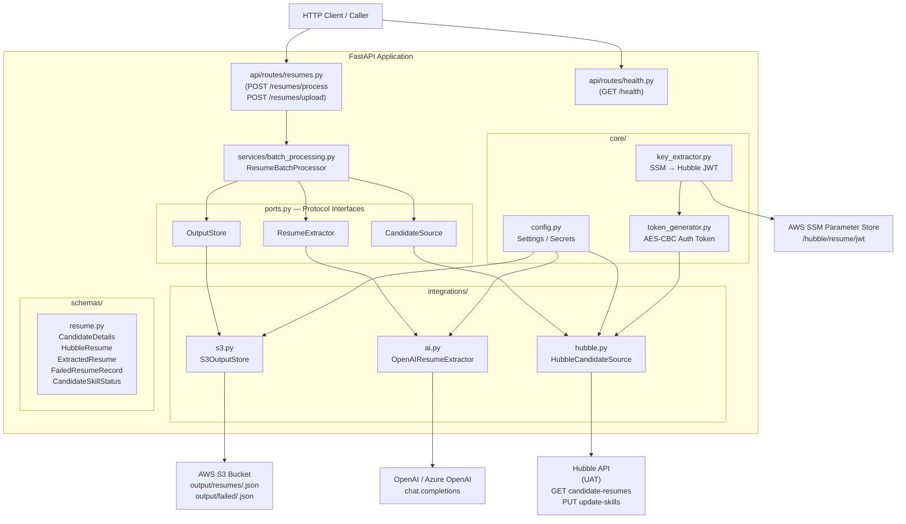
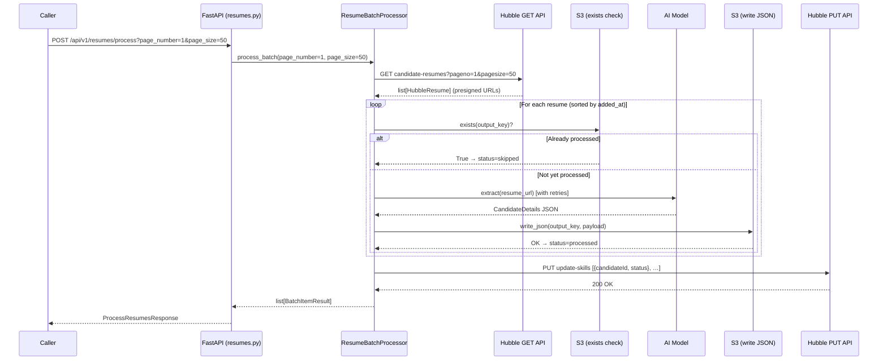

# Architecture

## Overview

The service follows a **ports-and-adapters (hexagonal)** design.
Business logic in `services/` is decoupled from external systems through
the abstract `Protocol` interfaces defined in `ports.py`. Each integration
(`hubble.py`, `ai.py`, `s3.py`) is a concrete adapter that can be swapped or
mocked independently.

---

## Component Diagram

---

## End-to-End Data Flow

---

## Layered Layout

| Layer | Path | Responsibility |
|---|---|---|
| **HTTP boundary** | `api/routes/` | Request parsing, response shaping, HTTP errors |
| **Orchestration** | `services/batch_processing.py` | Batch loop, ordering, skip/retry/fail logic, status collection |
| **Ports** | `ports.py` | `Protocol` interfaces — the seam between business logic and adapters |
| **Adapters** | `integrations/` | Hubble HTTP client, OpenAI/Azure client, S3 boto3 client |
| **Configuration** | `core/config.py` | `pydantic-settings` — all env-driven settings |
| **Auth helpers** | `core/key_extractor.py`, `core/token_generator.py` | SSM fetch + AES-CBC token generation for Hubble auth |
| **Contracts** | `schemas/resume.py` | Pydantic models for input/output; alias normalisation; dice_context detection |

---

## Key Design Decisions

### Idempotency via S3 existence check
Before each extraction attempt, `S3OutputStore.exists()` is called with the
deterministic `output_key` (`output/resumes/<candidate_id>.json`).
This makes the workflow **restartable at zero cost** — no external state
database is required.

### Ports-and-adapters (Protocol interfaces)
`ResumeBatchProcessor` depends on three `Protocol` types: `CandidateSource`,
`ResumeExtractor`, and `OutputStore`. Tests use `FakeSource`, `FakeExtractor`,
and `FakeStore` — no HTTP or AWS calls needed in CI.

### Configurable AI system prompt
The extraction instructions live entirely in `AI_SYSTEM_PROMPT` (`.env`),
not in application code. This lets the prompt be tuned without a code
deployment.

### Dice context detection
After AI extraction, the raw resume text is scanned for Dice-specific markers
(e.g., `@mail.dice.com`). If found, `dice_context=true` is injected into the
`CandidateDetails` response, flagging that the document may include appended
Dice profile pages that were excluded from the extraction.

### AES-CBC auth token for Hubble
The Hubble API requires a Bearer token generated by AES-CBC encrypting the
current Eastern Date-Time with the Hubble JWT key (fetched from AWS SSM at
startup). This logic is isolated in `core/token_generator.py`.
