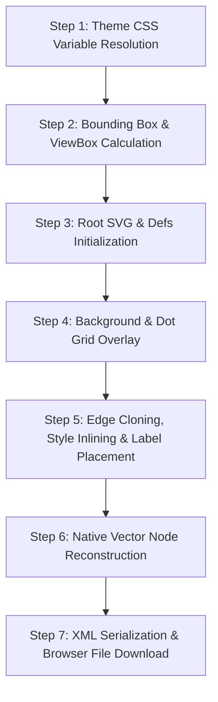

# SVG Export Implementation Guide

This document provides a detailed, step-by-step breakdown of how the **Export SVG** feature is implemented in the MITRA AI analysis module.

## Source Location

- **File**: [`frontend/src/routes/migration/architecture/-architecture-diagram.tsx`](file:///d:/code/mitra-ai/frontend/src/routes/migration/architecture/-architecture-diagram.tsx)
- **Function**: [`exportSvg()`](file:///d:/code/mitra-ai/frontend/src/routes/migration/architecture/-architecture-diagram.tsx#L240-L844)
- **UI Trigger**: Button in top control `<Panel>` ([lines 947-955](file:///d:/code/mitra-ai/frontend/src/routes/migration/architecture/-architecture-diagram.tsx#L947-L955))

---

## Architectural Goal

The SVG Exporter converts the interactive **React Flow** architecture canvas into a clean, standalone, vector-native `.svg` file. 

Instead of relying on raster screenshots (HTML5 Canvas/PNG) or embedding complex HTML via SVG `<foreignObject>` tags (which break in desktop graphic editors like Adobe Illustrator or Inkscape), this exporter **reconstructs all visual nodes and edges into pure, native SVG elements**.

---

## Step-by-Step Implementation Workflow



---

### Step 1: Theme CSS Variable Resolution

To ensure the exported SVG reflects the active app theme (Light or Dark) and displays consistently when viewed outside the browser:
- Reads computed CSS variables directly from `:root` using `window.getComputedStyle(document.documentElement)`.
- Resolves custom tokens including `--background`, `--surface`, `--border`, `--text-primary`, `--text-secondary`, `--text-muted`, and `--accent`.
- Provides explicit fallback hex codes in case custom properties are missing.

```ts
const resolveCssVar = (varName: string, fallback: string) => {
  const value = window.getComputedStyle(document.documentElement).getPropertyValue(varName).trim()
  return value || fallback
}

const resolvedBackground = resolveCssVar('--background', '#0f172a')
const resolvedSurface = resolveCssVar('--surface', '#1e293b')
const resolvedBorder = resolveCssVar('--border', '#334155')
const resolvedTextPrimary = resolveCssVar('--text-primary', '#f8fafc')
const resolvedTextSecondary = resolveCssVar('--text-secondary', '#94a3b8')
const resolvedTextMuted = resolveCssVar('--text-muted', '#64748b')
const resolvedAccent = resolveCssVar('--accent', '#3b82f6')
```

---

### Step 2: Bounding Box & Canvas Calculation

To avoid exporting excessive whitespace or clipping visible components:
1. Traverses all visible nodes in `displayNodes`.
2. Measures exact rendered dimensions from DOM nodes using `nodeEl.offsetWidth` and `nodeEl.offsetHeight` (falling back to node data).
3. Tracks `minX`, `minY`, `maxX`, and `maxY` across all nodes.
4. Adds a fixed padding of `60px` around all sides.
5. Computes total canvas dimensions and constructs the SVG `viewBox`:

```ts
const padding = 60
const svgX = minX - padding
const svgY = minY - padding
const svgWidth = (maxX - minX) + padding * 2
const svgHeight = (maxY - minY) + padding * 2
const viewBox = `${svgX} ${svgY} ${svgWidth} ${svgHeight}`
```

---

### Step 3: Root SVG Element & `<defs>` Setup

Creates a clean root SVG element using standard XML namespace (`http://www.w3.org/2000/svg`) and appends reusable definitions:

1. **Arrowhead Markers**: Clones existing marker defs from `.react-flow` to preserve edge direction arrows.
2. **Background Dot Pattern**: Programmatically constructs a `<pattern id="exported-bg-pattern">` with a `20x20` unit tile and a `0.5px` radius dot circle filled with `resolvedBorder`.
3. **Card Corner ClipPaths**: Generates `<clipPath id="clip-${node.id}">` entries with `rx="12" ry="12"` rounded rectangles for each card node to ensure accent bars do not bleed past rounded edges.

```ts
const exportedSvg = createSvgElement('svg', {
  width: String(svgWidth),
  height: String(svgHeight),
  viewBox: viewBox,
})

const defsElement = createSvgElement('defs', {})
exportedSvg.appendChild(defsElement)
```

---

### Step 4: Background & Dot Grid Overlay

Draws two full-width background rectangles:
1. **Solid Background**: `<rect>` covering the full `viewBox` using `fill: resolvedBackground`.
2. **Dot Grid Overlay**: `<rect>` covering the full `viewBox` using `fill: url(#exported-bg-pattern)`.

```ts
const bgRect = createSvgElement('rect', {
  x: String(svgX),
  y: String(svgY),
  width: String(svgWidth),
  height: String(svgHeight),
  fill: resolvedBackground,
})
exportedSvg.appendChild(bgRect)

const gridOverlay = createSvgElement('rect', {
  x: String(svgX),
  y: String(svgY),
  width: String(svgWidth),
  height: String(svgHeight),
  fill: 'url(#exported-bg-pattern)',
})
exportedSvg.appendChild(gridOverlay)
```

---

### Step 5: Edge Cloning, Style Inlining & Label Placement

1. **Edge Paths**: Selects live edges from `.react-flow__edges`, clones the SVG subtree, and inlines computed CSS styles (`fill`, `stroke`, `stroke-width`, `stroke-dasharray`, `opacity`).
2. **Edge Labels**:
   - Locates the edge SVG path element (`.react-flow__edge-path`).
   - Obtains total path length (`pathEl.getTotalLength()`).
   - Calculates the exact mid-point coordinate vector (`pathEl.getPointAtLength(totalLength / 2)`).
   - Draws a centered SVG `<g>` container with a background `<rect>` pill and monospace `<text>` label.

```ts
const totalLength = pathEl.getTotalLength()
const point = pathEl.getPointAtLength(totalLength / 2)

const labelGroup = createSvgElement('g', { class: 'edge-label-group' })
// Renders background rect and centered text at (point.x, point.y)
```

---

### Step 6: Native Vector Node Reconstruction

Translates React node components into vector shapes:

#### Swimlane Nodes
- Rendered as `<rect>` container with `rx="16" ry="16"`, dashed stroke (`stroke-dasharray: 5,5`), and upper-case title `<text>`.

#### Standard Cards (MuleSoft Flows, AWS Lambdas, Triggers, Destinations)
- **Clipped Group**: Wraps background `<rect>` and left/right color accent bars in `<g clip-path="url(#clip-${node.id})">`.
- **Accent Bars**: Draws `4px` left/right vertical color strips corresponding to connector types or AWS services.
- **Outer Border**: Unclipped outer `<rect>` (`rx="12" ry="12"`) for crisp border rendering (highlighted in `resolvedAccent` when selected).
- **Badges & Labels**:
  - Top-left component badge pill (`<rect>` + uppercase monospace `<text>`).
  - Top-right complexity/risk text or AWS badge pill.
  - Card Title, Subtitle, and Details rendered with monospace font family and text truncation (`length > 36`, `length > 46`, `length > 50`).

---

### Step 7: XML Serialization & Instant Browser Download

1. Converts the DOM SVG structure into a clean XML string using `XMLSerializer().serializeToString(exportedSvg)`.
2. Creates a Blob with `type: 'image/svg+xml;charset=utf-8'`.
3. Creates a temporary Object URL via `URL.createObjectURL(blob)`.
4. Spawns an anchor (`<a>`) element with filename `architecture-topology-[upload_id].svg`.
5. Triggers programmatic click to start browser download.
6. Instantly removes anchor element and revokes Object URL memory via `URL.revokeObjectURL(url)`.

```ts
const svgString = new XMLSerializer().serializeToString(exportedSvg)
const blob = new Blob([svgString], { type: 'image/svg+xml;charset=utf-8' })
const url = URL.createObjectURL(blob)

const element = document.createElement('a')
element.href = url
element.download = `architecture-topology-${topology?.upload_id || 'export'}.svg`
document.body.appendChild(element)
element.click()
document.body.removeChild(element)
URL.revokeObjectURL(url)
```

---

## Summary of Exporter Advantages

| Feature | MITRA AI Native SVG Exporter | Standard Screenshot / html2canvas |
| :--- | :--- | :--- |
| **Resolution** | Vector (Infinite scale without pixelation) | Raster (Pixelated on zoom) |
| **Graphic Editor Compatibility** | Native SVG (Editable in Illustrator/Inkscape) | Broken (HTML embedded in SVG fails to render) |
| **Theme Fidelity** | Matches active app Light/Dark mode | Captured statically |
| **File Size** | Lightweight XML text | Large binary image |
