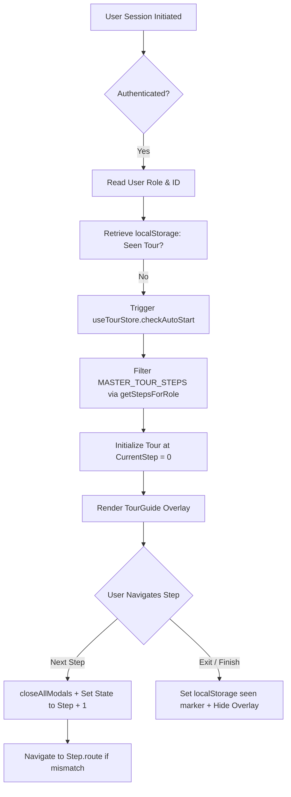

# Role-Gated Tour Guide System Implementation Documentation

This document provides a comprehensive, production-grade technical specification of the interactive onboarding tour system implemented in **Mitra AI**. It details the centralized architecture, Role-Based Access Control (RBAC) filtering, frontend edge-case resolutions, user experience enhancements, and state persistence mechanics.

---

## 1. Executive Overview & Problem Statement

### 1.1 Purpose
The interactive onboarding tour system in Mitra AI guides new and returning users through the platform's primary modules (e.g., Dashboard, Project Management, User Governance, and Migration Workflows). By providing context-aware visual overlays and step-by-step guidance tailored to the user's operational role, the system reduces onboarding friction and accelerates adoption.

### 1.2 Transition to a DRY Architecture
Previously, interactive tours often suffered from fragmented configurations, scattered page-level checks, and hardcoded step counters (e.g., manually rendering `Step 2 of 4` within a page view). This manual approach introduced several challenges:
- **Tight Coupling**: Adding or reordering steps required modifications to multiple page components.
- **Role Leakage**: Code for user-exclusive steps was loaded and evaluated on pages accessed by administrators, increasing the likelihood of runtime errors.
- **Inconsistent Progress Calculation**: Manual index tracking was highly error-prone when steps were filtered out dynamically.

To address these limitations, the system was refactored into a **Don't Repeat Yourself (DRY) architecture** that leverages:
1. A single centralized configuration file.
2. A client-side state machine implemented via Zustand.
3. Decoupled layout components that consume state dynamically rather than tracking local indices.

---

## 2. Centralized Architecture & RBAC Design

The tour system's architecture relies on three primary components:
1. **Centralized Configuration**: [tourConfig.ts](file:///d:/code/mitra-ai/frontend/src/config/tourConfig.ts)
2. **Global State Store**: [tour.ts](file:///d:/code/mitra-ai/frontend/src/stores/tour.ts)
3. **Presenter Overlay Component**: [TourGuide.tsx](file:///d:/code/mitra-ai/frontend/src/components/TourGuide.tsx)



### 2.1 Centralized Configuration (`tourConfig.ts`)
All steps are declared inside the `MASTER_TOUR_STEPS` array within [tourConfig.ts](file:///d:/code/mitra-ai/frontend/src/config/tourConfig.ts). Each step implements the `TourStep` interface:

```typescript
export type UserRole = 'Super Admin' | 'Admin' | 'User';

export interface TourStep {
  id: string;                         // Unique step identifier
  route?: string;                     // Target route path (triggers navigation if current route doesn't match)
  target: string;                    // Target DOM query selector (e.g., '[data-tour="nav-sidebar"]')
  title: string;                      // Step title shown in card header
  description: string;                // Contextual guide copy
  allowedRoles: UserRole[];           // List of roles permitted to view this step
  placement?: 'right-start' | 'right' | 'bottom-start' | 'bottom' | 'top' | 'left' | 'center';
  previewType?: 'sidebar' | 'intake-card' | 'org-modal-subflow' | 'project-modal-subflow' | 'user-modal-subflow';
}
```

### 2.2 Dynamic Filtering Hook (`useTourStore`)
Instead of referencing static arrays directly in UI code, steps are dynamically filtered at runtime using `getStepsForRole` in [tourConfig.ts](file:///d:/code/mitra-ai/frontend/src/config/tourConfig.ts#L22-L24):

```typescript
export const getStepsForRole = (role: UserRole): TourStep[] => {
  return MASTER_TOUR_STEPS.filter((step) => step.allowedRoles.includes(role));
};
```

The filtered subset is resolved within [TourGuide.tsx](file:///d:/code/mitra-ai/frontend/src/components/TourGuide.tsx#L26-L27) based on the active user profile from [auth.ts](file:///d:/code/mitra-ai/frontend/src/stores/auth.ts):

```typescript
const steps = getStepsForRole(userRole);
const step = steps[currentStep];
```

This dynamically computes progress statistics (e.g., rendering `Step {currentStep + 1} of {steps.length}` in the footer) without hardcoded values.

### 2.3 Theme Isolation & Overlay Dismissal Protection
The system ensures that toggling between Light and Dark mode does not interrupt the onboarding experience.
- **Theme Tracking**: Instead of reading theme context which might trigger unnecessary re-renders, the [TourGuide.tsx](file:///d:/code/mitra-ai/frontend/src/components/TourGuide.tsx#L37-L49) uses a `MutationObserver` directly on `document.documentElement` to look for class attribute changes (`dark` vs. `light`).
- **Dismissal Prevention**: Clicking the backdrop normally closes the tour overlay. However, to allow users to toggle themes during the tour, [handleBackdropClick](file:///d:/code/mitra-ai/frontend/src/components/TourGuide.tsx#L268-L292) inspects click targets:

```typescript
const handleBackdropClick = (e: React.MouseEvent<SVGElement>) => {
  const target = e.target as HTMLElement;

  // Prevent dismiss if theme toggle button, container or inside tour-popover-card is clicked
  if (target && typeof target.closest === 'function') {
    if (target.closest('[data-tour="theme-toggle"]') || target.closest('.tour-popover-card')) {
      return;
    }
  }

  // Coordinate-based backup check for toggle button
  const themeToggleEl = document.querySelector('[data-tour="theme-toggle"]') as HTMLElement | null;
  if (themeToggleEl) {
    const rect = themeToggleEl.getBoundingClientRect();
    const inX = e.clientX >= rect.left && e.clientX <= rect.right;
    const inY = e.clientY >= rect.top && e.clientY <= rect.bottom;
    if (inX && inY) {
      themeToggleEl.click();
      return;
    }
  }

  closeTour(userIdOrEmail);
};
```

---

## 3. Critical Frontend Edge-Case Resolutions

### 3.1 Modal Lifecycle & Route Transitions
When a user navigates between steps that transition across different pages, any open creation dialogs (e.g., the Organization creation modal, Project creator, or User provisioner) must be closed to avoid overlapping backdrops or DOM leaks.

The cleanup sequence operates as follows:
1. When `nextStep()` or `prevStep()` is called on the [useTourStore](file:///d:/code/mitra-ai/frontend/src/stores/tour.ts), it invokes `closeAllModals()`.
2. `closeAllModals()` dispatches a custom DOM event:
   ```typescript
   closeAllModals: () => {
     if (typeof window !== 'undefined') {
       window.dispatchEvent(new CustomEvent('mitra-tour-close-modals'));
     }
   }
   ```
3. Dialog containers listen for this event and close themselves programmatically:
   ```typescript
   useEffect(() => {
     const handleClose = () => setOpen(false); // or parent callback
     window.addEventListener('mitra-tour-close-modals', handleClose);
     return () => window.removeEventListener('mitra-tour-close-modals', handleClose);
   }, []);
   ```

### 3.2 Double-Backdrop Z-Index Layering
Native modal dialogs bring their own `bg-black/60 backdrop-blur-sm` overlay, which clashes with the SVG spotlight backdrop of the Tour Guide, causing the screen to become doubly darkened.

To resolve this:
1. The custom primitive [DialogContent](file:///d:/code/mitra-ai/frontend/src/components/ui/dialog.tsx#L27-L48) accepts an `isTourActive` boolean property.
2. When `isTourActive` is true, the native backdrop styling is overridden to be transparent with no blur:
   ```tsx
   <DialogOverlay className={isTourActive ? 'bg-transparent backdrop-blur-none pointer-events-none' : ''} />
   ```
3. This allows the Tour Spotlight backdrop to remain the only active overlay, maintaining visual clarity.

### 3.3 Viewport Auto-Centering & Collision Avoidance
To guide users effectively, target elements must reside within the visible viewport before the spotlight SVG mask and popover calculate their positions.

- **Auto-Scrolling**: [TourGuide.tsx](file:///d:/code/mitra-ai/frontend/src/components/TourGuide.tsx#L139-L142) triggers a smooth scroll to center the element when a step loads:
  ```typescript
  if (lastScrolledStepRef.current !== step.id) {
    lastScrolledStepRef.current = step.id;
    element.scrollIntoView({ behavior: 'smooth', block: 'center' });
  }
  ```
- **Collision Avoidance (Flip & Shift Middleware)**: Rather than relying on simple bounding-box arithmetic which clips off-screen when elements are close to viewport margins, [TourGuide.tsx](file:///d:/code/mitra-ai/frontend/src/components/TourGuide.tsx#L215-L250) implements layout constraint middleware:
  - **Flip**: If a step's default placement (e.g., `bottom`) goes off-screen, it flips to the opposite side (`top`).
  - **Shift**: Clamps coordinates to a minimum margin of `16px` from the viewport edges to ensure the popover remains fully visible on smaller viewports.

---

## 4. Role-Based Feature Matrix

The following matrix maps out the complete 14-step onboarding flow across all application routes and roles:

| Step Sequence | Step ID | Target DOM Attribute | Route Path | Super Admin | Admin | User | Description |
| :---: | :--- | :--- | :--- | :---: | :---: | :---: | :--- |
| **1** | `nav-sidebar` | `[data-tour="nav-sidebar"]` | `/dashboard` | ✓ | ✓ | ✓ | Navigation sidebar overview |
| **2** | `metric-overview` | `[data-tour="metric-overview"]` | `/dashboard` | ✓ | ✓ | ✓ | Platform analytics and telemetry metrics |
| **3** | `findings-section` | `[data-tour="findings-section"]` | `/dashboard` | ✓ | ✓ | ✓ | Flow inventory & XML findings overview |
| **4** | `analysis-drawer` | `[data-tour="analysis-drawer"]` | `/dashboard` | ✓ | ✓ | ✓ | Live analysis parsing queue |
| **5** | `org-management` | `[data-tour="org-header-row"]` | `/organizations` | ✓ | — | — | Multi-tenant organization portal |
| **6** | `admin-project-cards` | `[data-tour="project-header-row"]` | `/projects` | ✓ | ✓ | — | Portfolio audit for admins |
| **7** | `admin-project-create` | `[data-tour="project-create-btn"]` | `/projects` | ✓ | ✓ | — | Provisioning new migration engagements |
| **8** | `user-management-header`| `[data-tour="user-header-row"]` | `/users` | ✓ | ✓ | — | Centralized workspace overview |
| **9** | `user-management-add-btn`| `[data-tour="user-create-btn"]` | `/users` | ✓ | ✓ | — | Provisioning dialog for invitation |
| **10** | `user-management-table` | `[data-tour="user-table-header"]` | `/users` | ✓ | ✓ | — | Access governance directory table |
| **11** | `user-assigned-projects`| `[data-tour="project-header-row"]` | `/projects` | — | — | ✓ | Projects workspace list for user |
| **12** | `user-upload-archive` | `[data-tour="project-upload-dropzone"]`| `/migration/uploads`| — | — | ✓ | Upload zip package for analysis |
| **13** | `user-analyze-project` | `[data-tour="project-analysis-view"]` | `/migration/analysis`| — | — | ✓ | Extracted flows, complexity, connector maps|
| **14** | `user-architecture-topology` | `[data-tour="project-architecture-map"]`| `/migration/architecture`| — | — | ✓ | Topology maps and SVG downloads |

---

## 5. State Persistence & Re-Trigger Mechanics

### 5.1 First-Time Auto-Trigger
To target only un-onboarded accounts, the system hooks into the main route wrapper [__root.tsx](file:///d:/code/mitra-ai/frontend/src/routes/__root.tsx#L64-L70). Upon successful authentication, the system checks for a local storage key scoped to the specific user ID or email:

```typescript
const key = `mitra_tour_seen_${userIdOrEmail}`;
```

If the key is absent, the Zustand store sets `isOpen: true` and starts the tour at step 0:
```typescript
checkAutoStart: (userIdOrEmail: string, role: UserRole) => {
  if (!userIdOrEmail) return;
  const key = `mitra_tour_seen_${userIdOrEmail}`;
  const seen = localStorage.getItem(key) === 'true';
  if (!seen && !get().isOpen) {
    set({ isOpen: true, currentStep: 0 });
  }
}
```

### 5.2 Profile Menu Re-Trigger
Users can manually restart the onboarding flow at any time. This action is accessible from the profile dropdown menu in the bottom-left corner of the sidebar, implemented in [Sidebar.tsx](file:///d:/code/mitra-ai/frontend/src/components/layout/Sidebar.tsx#L452-L461):

```tsx
<DropdownMenuItem
  data-tour="user-profile-menu"
  className="cursor-pointer text-[var(--text-secondary)]"
  onClick={() => {
    navigate({ to: '/dashboard' });
    useTourStore.getState().startTour();
  }}
>
  <Activity size={14} className="mr-2 text-[var(--accent)]" /> Start Tour
</DropdownMenuItem>
```

Selecting "Start Tour" redirects the user to `/dashboard` and resets the store coordinates back to step 0.

### 5.3 Local Storage Schema
The following table outlines the client-side state schema:

| Key Name | Value Type | Purpose | Expiration |
| :--- | :--- | :--- | :--- |
| `mitra_tour_seen_${userIdOrEmail}` | `boolean` (stored as `'true'`) | Flags whether the user completed or explicitly skipped the tour. | Persistent (cleared only on manual browser storage clear) |
| `mitra-theme` | `'light' \| 'dark'` | Active theme preference. Decoupled from tour state. | Persistent |
| `mitra-ui` | `object` | Holds UI preferences, such as `sidebarExpanded` and `panelExpanded`. | Persistent |

---

## 6. Verification & Run Diagnostics

For validation and debugging, developers can use the browser's console to inspect or modify the active tour state:

```javascript
// Check current step and tour status
console.log(window.localStorage.getItem(`mitra_tour_seen_${userId}`));

// Reset tour state for testing
window.localStorage.removeItem(`mitra_tour_seen_${userId}`);
window.location.reload();
```
