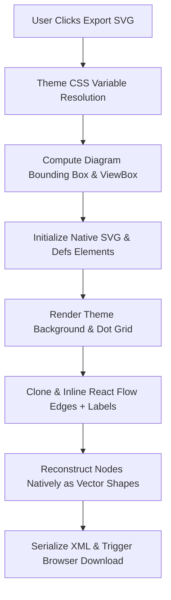

# Architecture Diagram Export SVG Implementation

## Overview
The **Export SVG** button allows users to export the active MuleSoft / AWS Architecture Topology diagram directly from the browser into a high-fidelity, scalable SVG image file (`.svg`). 

Unlike simple screenshot utilities, this implementation reconstructs the interactive React Flow canvas into a clean, standalone, vector-native SVG element. This ensures resolution independence, crisp text rendering, accurate theme styling, and zero reliance on HTML `foreignObject` rendering wrappers.

---

## File Location & Entry Point

- **UI File**: [`frontend/src/routes/migration/architecture/-architecture-diagram.tsx`](file:///d:/code/mitra-ai/frontend/src/routes/migration/architecture/-architecture-diagram.tsx)
- **Function Handler**: [`exportSvg()`](file:///d:/code/mitra-ai/frontend/src/routes/migration/architecture/-architecture-diagram.tsx#L240-L844)
- **UI Button Trigger**: Lines [`947-955`](file:///d:/code/mitra-ai/frontend/src/routes/migration/architecture/-architecture-diagram.tsx#L947-L955)

```tsx
<Button
  variant="outline"
  size="sm"
  className="h-8 px-3 text-[11px] bg-[var(--background)] hover:bg-[var(--accent)]/10 text-[var(--text-primary)]"
  onClick={exportSvg}
>
  <Download size={12} className="mr-1.5 shrink-0" />
  Export SVG
</Button>
```

---

## Technical Architecture & Pipeline



### Pipeline Details

### 1. Dynamic CSS Theme Resolution
To ensure exported SVGs look accurate in both Light and Dark themes:
- Evaluates CSS custom property tokens (`--background`, `--surface`, `--border`, `--text-primary`, `--accent`, etc.) using `window.getComputedStyle(document.documentElement)`.
- Fallbacks are provided for standalone viewing outside the app context.

```ts
const resolveCssVar = (varName: string, fallback: string) => {
  const value = window.getComputedStyle(document.documentElement).getPropertyValue(varName).trim()
  return value || fallback
}
```

---

### 2. Canvas Bounding Box & Padding
Instead of exporting arbitrary screen viewport coordinates or huge empty spaces:
- Dynamically iterates over all visible `displayNodes` positions (`node.position.x`, `node.position.y`) and dimensions (`offsetWidth`/`offsetHeight`).
- Computes `minX`, `minY`, `maxX`, `maxY`.
- Applies a `60px` margin padding to construct a tight `viewBox` around the actual diagram content.

```ts
const padding = 60
const svgX = minX - padding
const svgY = minY - padding
const svgWidth = (maxX - minX) + padding * 2
const svgHeight = (maxY - minY) + padding * 2
const viewBox = `${svgX} ${svgY} ${svgWidth} ${svgHeight}`
```

---

### 3. SVG & Element Construction
Uses `document.createElementNS('http://www.w3.org/2000/svg', tagName)` to dynamically build valid XML node trees.

- **Marker Defs**: Clones markers (arrowheads) from live React Flow DOM defs (`.react-flow defs`).
- **Dot Grid Pattern**: Creates a synchronized `<pattern id="exported-bg-pattern">` with `<circle>` elements matching the live canvas background grid.
- **Node ClipPaths**: Injects `<clipPath id="clip-${node.id}">` elements to cleanly round card corners and clip accent color bars.

---

### 4. Edge Style Inlining & Label Projection
React Flow edge styling uses external CSS classes. The exporter:
- Clones SVG edge paths from `.react-flow__edges`.
- Copies and inlines computed stroke properties (`stroke`, `stroke-width`, `stroke-dasharray`, `opacity`).
- Computes exact edge label midpoint coordinates using SVG path geometric API (`pathEl.getPointAtLength(totalLength / 2)`).
- Renders native `<g>`, `<rect>`, and `<text>` elements for edge labels.

---

### 5. Native Vector Node Reconstruction
Rather than embedding HTML elements via `<foreignObject>` (which can render inconsistently across vector viewers or graphic design tools):
- Converts React components into pure SVG shapes:
  - **Swimlane Groups**: Rendered as outer bounding `<rect>` with dashed border strokes and uppercase header `<text>`.
  - **Card Nodes**: Rendered using clipped surface `<rect>`, left/right color accent strips (`leftColor`/`rightColor`), outer border `<rect>`, top badges, AWS service indicators, title/subtitle lines, and details with text length truncation safeguards.

---

### 6. XML Serialization & File Download
- Serializes exported SVG DOM node into XML using `XMLSerializer().serializeToString(exportedSvg)`.
- Wraps string in `Blob([svgString], { type: 'image/svg+xml;charset=utf-8' })`.
- Programmatically triggers browser file download via temporary `<a>` element:

```ts
const svgString = new XMLSerializer().serializeToString(exportedSvg)
const blob = new Blob([svgString], { type: 'image/svg+xml;charset=utf-8' })
const url = URL.createObjectURL(blob)

const element = document.createElement('a')
element.href = url
element.download = `architecture-topology-${topology?.upload_id || 'export'}.svg`
document.body.appendChild(element)
element.click()
document.body.removeChild(element)
URL.revokeObjectURL(url)
```

---

## Technical Highlights & Advantages

1. **Standalone Compatibility**: Converted SVG files require zero external CSS files or web app context to display properly in Adobe Illustrator, Inkscape, standard image viewers, or web browsers.
2. **Theme Preservation**: Captures live active theme colors automatically at export time.
3. **No `foreignObject` Rendering Flaws**: Avoids missing font / canvas clipping issues common when exporting HTML-in-SVG wrappers.
4. **Automatic Memory Cleanup**: Calls `URL.revokeObjectURL(url)` immediately after triggering file download to prevent browser memory leaks.
